<!-- cSpell:language de -->

# Wirtschaftslehre im StudienKolleg

> # 经济学(预科版)

## 1.Der Gegenstand der Wirtschaftswissen

## 2. Wirtschaftswissenschaftliche Arbeitsmethode

### 2.3 Wirtschaftskreisläufe

### 2.9 Wiederholungsaufgabe

1. Was verstehen Sie unter einem Denkmodell und welchem Zweck dient es?

> Denkmodell ist eine vereinfachte Repräsentation komplexer Dinge.（对复杂事物的简单表示）
Zweck  

2. Nennen Sie ein Modell aus Ihrem Erfahrungsbereich (ein nicht wirtschaftswissenschaftliches Modell). Erklären Sie.Trennen Sie insbesondere (b) und (c) deutlich voneinander.

- (a)den Zweck, der mit der Schaffung des Modells verfolgt wird
- (b)worin die Vereinfachung liegt (mindestens 3 Vereinfachungen)
- (c)welche Elemente der Realität im Modell vernachlässigt werden (mindestens 3 Vernachlässigung)

> Beispiel: Landkarte

3. Wie können wirtschaftswissenschaftliche Modelle dargestellt werden?

> Grafische Darstellung, analytische Darstellung, verbale Darstellung.

4. Was verstehen Journalisten falsch, wenn sie den *homo oeconomicus* als einen nur auf materielle Ziele fixierten Menschen interpretieren?

  > Homo oeconomicus ist einen Modell, aber kein Mensch.
  > Journalisten interpretieren den homo oeconomicus oft falsch als rein materialistisch. Tatsächlich ist homo oeconomicus rational und strebt der nach Nutzenmaximierung, wobei der Nutzen auch immaterielle Aspekte umfassen kann.

5. Vergleichen Sie den einfachen und den erweiterten Wirtschaftskreislauf.

  > Vereinfachung:nur Haushalt und  Unternehmen
    AV verändert sich nicht
    Alle Produkte von Unternehmen werden gekauft und Haushalten sparen kein Geld 
    Güter und Geldströme Haushalt->Haushalt&Unternehmen->Unternehmen werden vernachlässigt
  > Erweiterung: Haushalt, Unternehmen, Kapitalsammelstellen(Bank), Staat und Ausland
    realistischer(nicht so viel Vernachlässigungen und Vereinfachungen wie einfache Wirtschaftskreislauf)

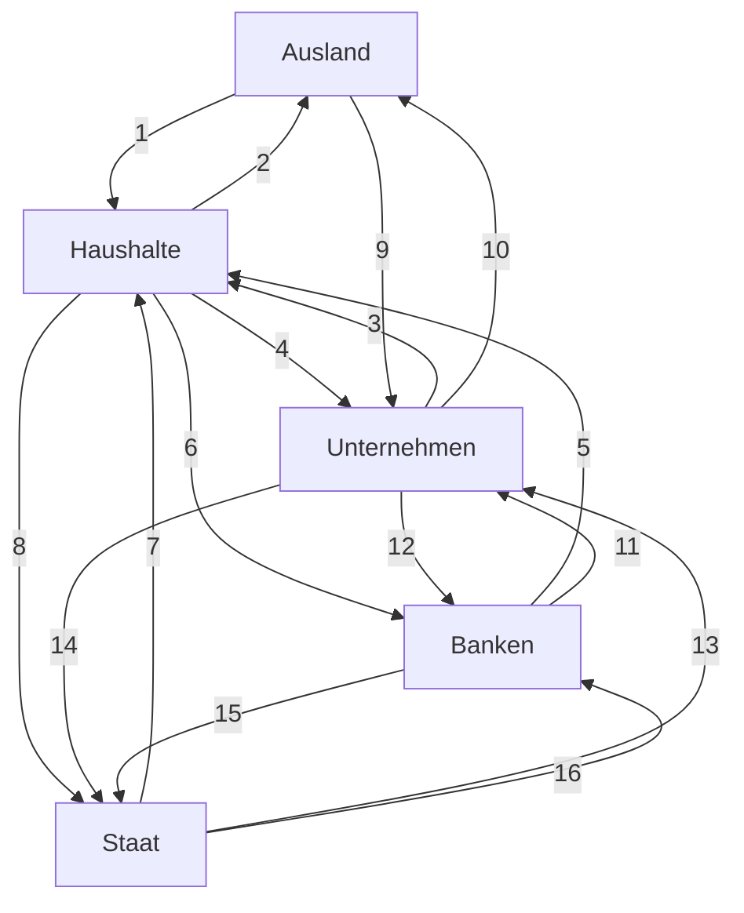

- (a) Ein deutscher Tourist bezahlt sein Hotel in Österreich.

  > Ein deutscher Tourist bezahlt sein Hotel in Österreich → 1
  > 德国游客在奥地利消费，属于居民对国外的支付。

- (b) Die Stadtverwaltung gleicht die Rechnung eines Dachdeckers für Bauarbeiten an einem Hallenschwimmbad aus.
- (c) Eine Hausfrau bezahlt an der Kasse eines Supermarktes.
- (d) Ein Landwirt erhält eine Prämie für die Stilllegung von landwirtschaftlichen Nutzungsflächen.
- (e) Ein Unternehmen überweist die fällige Körperschaftsteuer.

  > Ein Unternehmen überweist die fällige Körperschaftssteuer → 14
  > 企业缴纳企业所得税，属于企业对政府的支付。

- (f) Ein Unternehmen in Bremen erhält die 2. Rate aus einem Geschäft mit einem brasilianischen Importeur.

> Ein Unternehmen in Bremen erhält die 2. Rate aus einem Geschäft mit einem brasilianischen Importeur → 9
> 不来梅的企业收到来自巴西进口商的第二笔付款，属于国外对企业的支付。

- (g) Ein Geschäftsführer überweist seine Einkommensteuer.

> Ein Geschäftsführer überweist seine Einkommensteuer → 8/14
> 企业经理缴纳个人所得税，属于居民/企业对政府的支付。

- (h) Die Landesregierung überzieht ihr Girokonto bei der Westdeutschen Landesbank.

> Die Landesregierung überzieht ihr Girokonto bei der deutschen Landesbank → 15
> 州政府在德国州立银行透支账户，属于政府对银行的业务。

7. Innerhalb der Volkswirtschaftlichen Gesamtrechnung werden die Gruppen von Wirtschaftsakteuren „Sektoren" genannt. Nennen Sie Transaktionen innerhalb der Sektoren Haushalte und Unternehmungen, die im Modell des Wirtschaftskreislaufes nicht erfasst werden.

> Innerhalb der Haushalte: Taschengeld von Eltern an Kinder / Weihnachtsgeschenk umtauschen
> 家长给孩子零花钱 / 圣诞节互换礼物
> Innerhalb der Unternehmen: Lieferungen von Geld zwischen Abteilungen eines Unternehmens
> 单个公司中资金的往来

8. Welche Ziele können staatliche Unternehmen verfolgen und welche Auswirkung haben die Ziele auf den Gewinn der Unternehmen?

> Sie dienen überwiegend dazu, Versorgungsaufgaben zu erfüllen. Diese Ziele können den Gewinn schmälern, da soziale und gesellschaftliche Aspekte Vorrang vor der Gewinnmaximierung haben.

9. Stellen Sie an einem Beispiel dar, wie ein Bäcker seinen Erfolg nach dem Minimalprinzip und nach dem Maximalprinzip optimiert.

> Ein Bäcker optimiert nach dem Minimalprinzip:
>
> - Minimierung der Produktionskosten bei der gleichen Qualität (Wenn man 100 Brötchen produziert, soll die Kosten minimiert.)
>
> Nach dem Maximalprinzip:
>
> - Maximierung der Produktqualität (Wenn man selbe Brötchen aus der gleichen Rohstoffen produziert, soll die Qualität maximiert.)

## 3. Kennzahlen

## 4. Volkswirtschaftslehre

### 4.3.2 Die Makroökonomik

4.3.2 Die Makroökonomik
Die Makroökonomik als Teilgebiet der Wirtschaftstheorie betrachtet die Wirtschaft auf einer höher aggregierten (zusammenfassenden) Ebene im Gesamtzusammenhang. Im Mittelpunkt steht nicht die individuelle Entscheidung eines Wirtschaftsakteurs, sondern das Verhalten von Menschengruppen. Sie untersucht damit gesamtwirtschaftliche Zusammenhänge, d.h. das Zusammenspiel von maximal vier hoch aggregierten Märkten (Arbeitsmarkt, Gütermarkt, Geldmarkt und Kapitalmarkt) innerhalb eines administrativ entstandenen Wirtschaftsraumes, meist eines Landes. Die Makroökonomie greift damit teilweise auf die mikroökonomischen Erkenntnisse zum Marktmechanismus zurück.
Als Begründer der makroökonomischen Theorie gilt John Meynard Keynes mit seinem Buch "General Theory of Employment, Interest and Money" (Allgemeine Theorie der Beschäftigung, des Zinses und des Geldes) 1936, die wissenschaftliche Analyse gesamtgesellschaftlicher Fragestellungen beginnt allerdings schon mit den Merkantilisten bzw. früher. Analysiert werden Zusammenhänge und Methoden zur Erreichung einer erstrebenswerten wirtschaftlichen Entwicklung, die als „magisches Viereck" bezeichnet wird: hoher Beschäftigungsstand, stabiles Preisniveau, angemessenes und stetiges Wirtschaftswachstum und außenwirtschaftliches Gleichgewicht. Beispiele für Untersuchungsgegenstände sind die Änderung des Gesamt-einkommens oder des Beschäftigungsgrades, der Inflationsrate oder Konjunkturschwankungen und deren Folgen. Mittelpunkt makroökonomischer Theorien ist schließlich die Frage nach der Rolle des Staates in der Wirtschaft.
Wichtige Modelle der Makroökonomik sind das Modell des erweiterten Wirtschaftskreislaufes und die Gleichgewichtsmodelle (Vierquadrateinschema). Als Beispiel soll das Neoklassische Beschäftigungsgleichgewicht dienen:

> Was steigt in eine Depression(Inflation)?
> Steuer und Schuld.

> Steuern (Steuern)
> In Krisenzeiten neigen Regierungen dazu, die Steuern zu erhöhen, um die sinkenden Einnahmen auszugleichen und die steigenden Ausgaben zu finanzieren. Dies kann verschiedene Formen annehmen:
>
> - Erhöhung der Einkommensteuersätze
> - Verbreiterung der Steuerbemessungsgrundlage
> - Einführung neuer Steuern oder Abgaben
> - Allerdings ist der Spielraum für Steuererhöhungen oft begrenzt, da die Steuerquote in vielen fortgeschrittenen Volkswirtschaften bereits hoch ist.

> Staatsschulden (Staatsschulden)
> Die Staatsverschuldung steigt in Krisenzeiten in der Regel stark an. Gründe dafür sind:
>
> - Sinkende Steuereinnahmen aufgrund der wirtschaftlichen Schwäche
> - Steigende Ausgaben für Konjunkturprogramme und Sozialleistungen
> - Finanzierung von Krisenbekämpfungsmaßnahmen
>   In Deutschland stieg die Schuldenstandquote beispielsweise von knapp 60% vor der Korona-Krise auf über 70% des BIP

### 4.5 Wiederholungsaufgabe

1. Fertigen Sie eine Baumgrafik für das System der Wissenschaften, die Struktur der Wirtschaftswissenschaften und die Struktur der VWL an. Lassen Sie noch etwas Platz für die Struktur der BWL, die nach der folgenden Lektion ergänzt werden soll.
2. Vergleichen Sie die Mikro- und die Makroökonomik hinsichtlich folgender Kriterien:

- Entwicklung, Sichtweise, Forschungsobjekt und Modellbau.

## 5. Die Betriebswirtschaftslehre

> ## 5. 企业经济学（商业管理学）

### 5.0 Kleinen Test am 21.11.2024

I.Von welchem Sektor zu welchem Sektor fließen die **Geldströme** (z.B. Haushalt → Staat)?
Wenn zwei Geldströme fließen, benennen Sie die Geldströme bitte.

1. Ein türkischer Arbeiter, der in Deutschland arbeitet, überweist einen Teil seines Einkommens an seine Familie in der Türkei.
2. Ein Schiffsbaubetrieb erhält Subventionen.
3. Ein Professor bezahlt die Steuer für seinen PKW.
4. Eine Stadt bezahlt Rechnungen für den Bau eines Hallenbades an private Unternehmer.
5. Ein Haushalt spart 10% seines Einkommens.
6. Das BMW-Werk in Leipzig Verkauf Fahrzeuge nach Kanada.
7. Die Arbeiter eines Bauunternehmens erhalten Lohn.
8. Der Staat nimmt Kredit bei einer privaten Bank auf.
9. Deutsche Touristen geben in Kenia Geld aus.
10. Ein angestellter Lehrer zahlt Einkommensteuer.
11. Ein Friseur zahl Ladenniete an einen privaten Vermieter.
12. Eine Studentin kauft einige Lebensmittel ein und zahlt dabei Umsatzsteuer.
13. Ein privates Unternehmen legt einen Teil seines Gewinns bei einer privaten Bank an.

II. Richtig oder falsch? Wenn Sie sich für „falsch" entschieden haben, begründen Sie, warum.

1. Die abhängige Variable der Kostenfunktion ist das Output.
2. Der Gewinn ist die Differenz aus Erlös und Umsatz
3. Die Nutzenfunktion eines Gutes erläuft immer positiv.
4. Die Elastizität einer Größe zeigt die prozentuale Veränderung der abhängigen Variablen, wenn sich die unabhängige Variable an dieser Stelle um ein Prozent ändert.
5. In der grafische Darstellung der Nachfragefunktion trägt man die abhängige Variable auf der Abszisse und die unabhängige Variable auf der Ordinate ab. Die grafische Darstellung der Angebotsfunktion dagegen ist mathematisch korrekt.
6. Die Erlösfunktion im Polypol ist eine Ursprungsgrade.
7. Die Angebotsfunktion hat im Basismodell eine negative Steigung.
8. Die Erste Ableitung der Nutzenfunktion nennt man Grenzfunktion der Nutzenfunktion oder Grenznutzenfunktion.
9. Input bedeutet Wert der Faktoren, Output bedeutet Mengen der Produktionsergebnisse.
10. Wenn die Nachfragefunktion nach einem Gut in Abhängigkeit vom Einkommen des Nachfragers eine positive Steigung hat, nennt man das Gut Substitut.

### 5.1 Der Gegenstand der Betriebswirtschaftslehre

> ### 5.1 企业经济学的研究对象

Die Betriebswirtschaftslehre (Abkürzung `BWL`, in der Schweiz bei FacHaushaltochschulen `Betriebsökonomie`) ist ein Teilgebiet der Wirtschaftswissenschaft. Das Untersuchungsobjekt der Betriebswirtschaftslehre ist, worauf hier die Bezeichnung des Faches hinweist, der Betrieb bzw. das Unternehmen und seine Beziehungen zu anderen Wirtschaftsakteuren. Im Unterschied zur VWL, in der ein Unternehmen immer als „black box“ betrachtet wird, konzentriert sich die Betriebswirtschaftslehre auf die Strukturen und Vorgänge innerhalb des Unternehmens und beurteilt die Beziehungen zu anderen Wirtschaftsobjekten aus der Sicht des Unternehmens bzw. des Unternehmers. Es existieren allerdings nach wie vor Definitionsprobleme. Die Bezeichnungen „Unternehmen“, auch „Unternehmung“ und „Betrieb“ werden z.T. synonym als auch als unter- bzw. übergeordnete Begriffe verwendet.

> 企业经济学（简称 `BWL`，在瑞士高等院校称为 `Betriebsökonomie`，国内称为 `企业经济学`，`工商管理`或 `商业管理学`）是经济学的一个分支。企业经济学的研究对象是企业，这一点从该学科的名称中可以看出。有别于 VWL 中企业被视为一个“黑箱”，`BWL` 重点关注企业内部的结构和过程，以及从企业或人的角度来看，企业与其他经济参与者之间的关系。然而，正如定义问题所示，仍然存在一些不确定性。术语“`Unternehmen`”、“`Unternehmung`”以及“`Betrieb`”在某些情况下被部分地作为同义词或上位概念使用。

Ziele der `BWL` sind nicht nur die Beschreibung und Erklärung, sondern auch die konkrete Unterstützung der Entscheidungsprozesse in Unternehmen. Die `BWL` ist deshalb eine anwendungsorientierte Wissenschaft. Die theoretischen Grundlagen der `BWL` liefert im Wesentlichen die Mikroökonomie, konkrete die Unternehmenstheorie(Produktionstheorie und Kostentheorie, die der Angebotsfunktion begründen). Darüber hinaus greift die `BWL` auch auf Erkenntnisse der Haushaltstheorie, der Spieltheorie und anderer Teilgebiete der Mikroökonomie zurück. Da die Mikroökonomik aufgrund ihrer Zuordnung zur Wirtschaftstheorie Teilgebiet der VWL ist, jedoch die theoretischen Grundlage für die BWL liefert, nimmt sie ebenso wie die VWL eine klare Abgrenzung zwischen `VWL` und `BWL` ein.

> `BWL` 的目标不仅仅是描述企业结构和解释企业行为，而是具体支持其决策过程。因此，`BWL` 是一门应用科学。`BWL` 的理论基础主要来自微观经济学，尤其是~~企业理论~~（例如生产理论,成本理论和供应函数）。此外，`BWL` 还借鉴了家庭经济学、博弈论和其他微观经济学的分支理论。由于微观经济学作为经济理论的一个分支，属于国民经济学（`VWL`）的范畴，但同时为 `BWL` 提供了理论基础，因此微观经济学处于国民经济学和企业经济学的中间位置。

#### 5.1 词汇表

| 德文术语                           | 词性 | 复数形式                 | 中文翻译       | 解释/备注                                                                  |
| ---------------------------------- | ---- | ------------------------ | -------------- | -------------------------------------------------------------------------- |
| Betriebswirtschaftslehre (`BWL`) | f    | -                        | 企业经济学     | 研究企业及其运作和管理的学科。                                             |
| Volkswirtschaftslehre (VWL)        | f    | -                        | 国民经济学     | 研究整个国家或全球范围内经济活动的学科，关注宏观层面。                     |
| Wirtschaftsakteur                  | m    | -en                      | 经济活动的主体 | 在经济活动中参与交易或决策的个人或组织。（不包括政府以及各级人民代表大会） |
| Struktur und Vorgang               | f    | Strukturen und Vorgänge | 结构和过程     | -                                                                          |
| Entscheidungsprozess               | m    | -e                       | 决策过程       | -                                                                          |
| Mikroökonomie                     | f    | -                        | 微观经济学     | 研究个体经济单位行为的经济学分支。                                         |
| Produktionstheorie                 | f    | -n                       | 生产理论       | 研究生产过程中资源配置和产出关系的理论。                                   |
| Kostentheorie                      | f    | -n                       | 成本理论       | 分析企业如何最小化成本以实现利润最大化。                                   |
| Angebotsfunktion                   | f    | -en                      | 供给函数       | 描述价格与商品供应量之间关系的函数。                                       |
| Haushaltstheorie                   | f    | -n                       | 家庭经济学     | 研究家庭资源分配和消费行为的理论。                                         |
| Spieltheorie                       | f    | -n                       | 博弈论         | 分析决策者在竞争环境中的策略选择及其结果的理论。                           |

### 5.2 Geschichte der `BWL`

> ### 5.2 企业经济学的历史

Die `BWL` als Wissenschaft ist relativ jung. Als Geburtsstädte der modernen Betriebswirtschaftslehre werden häufig das in Schweiz, Österreich und Deutschland wird häufig das Jahr 1898 angesehen. Es entstanden in diesem Jahr im deutschsprachigen Raum Lehrstühle(Professuren) in St. Gallen, Leipzig, Aachen und Wien. Die *Wharton School of the University of Pennsylvania* war mit dem Gründungsjahr 1881 die erste Business School in den USA. In Frankreich existierte mit der *Ecole Supérieure de Commerce* in Paris bereits 1819 eine Business School.

> `BWL` 作为一门科学相对较新。瑞士、奥地利和德国被普遍认为是现代商业管理学的发源地，1898年被视为其诞生之年。在这一年，德语区的圣加仑、莱比锡、亚琛和维也纳等地设立了商业管理学的教授职位。1881 年成立的宾夕法尼亚大学沃顿商学院是美国的第一所商学院，而法国巴黎高等商业学院早在 1819 年就已经存在。

Da das Objekt der `BWL` viel älter ist, hat die Wissenschaft auch eine viel längere Vorgeschichte. Einzelne Teile der `BWL` im Sinne der Lehre des Kaufmannshandwerks, insbesondere des Rechnungswesens, existieren schon seit den alten Hochkulturen. Rechnungssysteme und Lagerhaltungsmodelle sind bekannt aus dem alten Ägypten (auf Papyrus), aus Ländern des Vorderen Orients (auf Tontafeln), aus dem alten China (auf Bambus). Das heute noch angewandte System der doppelten Buchführung hat sich im 15.Jh. infolge des Levantehandels in Italien (Handel mit den Produkten aus dem Osten über Syrien) entwickelt und wurde erstmals 1494 von dem italienischen Mathematiker *Luca Pacioli* (1445-1517) in seiner berühmten Enzyklopädie „*Summa de arithmetica*“ aufgezeichnet. Es gab neben diesem Buch mehr Literatur, das Kaufmannshandwerk wurde allerdings vorwiegend mündlich im Sinne einer Geheimlehre weitergegeben.

> 由于 `BWL` 的研究对象自古有之，故这门科学有着更长的发展历程。`BWL` 的某些部分，例如 `BWL` 中的商人技能（中世纪欧洲经济概念），自古代就已存在。会计系统和库存模型自古埃及（纸莎草纸）、美索不达米亚（泥板）、中国（竹简）等古代文明中就已知晓。如今广泛使用的复式记账法是在15世纪因意大利的黎凡特贸易（欧洲通过叙利亚与西亚，中东的贸易）而发展起来的，并于1494年首次由意大利数学家卢卡·帕乔利（Luca Pacioli，1445-1517）在其著名的百科全书《簿记论》中首次系统化记录下来。不过，在此书之前，商人技能主要通过口头传授，作为一种秘密技艺流传。

Als die bedeutendsten deutschsprachigen Vertreter der Allgemeinen Betriebswirtschaftslehre im 20. Jahrhundert gelten Eugen Schmalenbach (1873-1955), der der Betriebswirtschaftslehre ihren heutigen Namen gab und Erich Gutenberg (1897-1984), der die faktororientierte Betriebswirtschaftslehre begründete.

> 20 世纪最重要的德语区企业经济学代表人物之一是欧根·施马伦巴赫（1873-1955），他为 BWL 赋予了今天我们所叫的名称，并与埃里希·古腾堡（埃里希·蚝山）（1897-1984）一起创立了基于要素导向的企业管理理论。

> Tips:
> 1.“复式记账法”（也可以叫做“复式簿记”）描述的是会计工作中对每一项经济业务按相等金额在两个或两个以上有关账户相互对应地同时进行登记的记账方法。它衍生出一句非常著名的口诀“有借必有贷，借贷必相等”。
> 2.基于要素导向的企业管理理论是基于古腾堡所构思的企业管理方法的名称。其核心是对生产要素组合过程的概念。

~~（这段生词实在是太多了，很多概念在中文语境下没有找到对应的翻译。）~~

#### 5.2 词汇表

| 德文术语             | 词性 | 复数形式 | 中文翻译   | 解释/备注                                                  |
| -------------------- | ---- | -------- | ---------- | ---------------------------------------------------------- |
| Kaufmannshandwerk    | n    | -e       | 商人技艺   | 与贸易和商业相关的技能与知识。                             |
| Rechnungswesen       | n    | -        | 会计       | 记录、分类、总结和报告财务信息的系统。                     |
| Lagerhaltungsmodelle | n    | -        | 库存模型   | 管理库存水平和流动的方法与模型。                           |
| Doppelte Buchführung | f    | -        | 复式记账法 | 一种记录每笔交易时同时影响两个账户的会计方法。             |
| Levantehandel        | m    | -        | 黎凡特贸易 | 中世纪意大利与地中海东部地区，西亚（如叙利亚）的贸易活动。 |
| Geheimlehre          | f    | -        | 秘密技艺   | 一种通过口头传授而非书面记录传播的专业知识或技能。         |

### 5.3 Die Gliederung der BWL

> ### 5.3 BWL 的划分

#### 5.3.1 Die Allgemeine Betriebswirtschaftslehre

> #### 5.3.1 一般企业经济学

Die Betriebswirtschaftslehre gliedert sich in zwei Hauptbereiche: die Allgemeine Betriebswirtschaftslehre (ABWL) und die Speziellen Betriebswirtschaftslehren (SBWL). Die Allgemeine Betriebswirtschaftslehre (ABWL) befasst sich mit planerischen, organisatorischen und rechentechnischen Entscheidungen in Unternehmen. Sie gibt einen Überblick über die Wissenschaft der Betriebswirtschaftslehre, beschäftigt sich mit der Klassifikation des Betriebes (Was ist ein Betrieb? Warum werden Betriebe gebildet?) und analysiert Probleme, die alle Unternehmen unabhängig von ihrer Größe, Struktur, ihrem Output, ihrer Rechtsform, ihrem Erfolg usw. auftreten.

> 企业经济学分为两个主要领域：一般企业经济学（ABWL）和特殊企业经济学（SBWL）。一般企业经济学（ABWL）涉及企业中的计划、组织和计算技术决策。它概述了企业经济学的科学，处理企业的分类（什么是企业？为什么要建立企业？）并分析所有企业都会遇到的问题，无论其规模、结构、产出、形式、成功与否等。

Zugrunde liegt das funktionale Unternehmensmodell mit den ausgewählten betrieblichen Funktionen Unternehmensführung, Beschaffung, Produktion, Absatz und Finanzierung, Rechnungswesen usw.

> 基于所选的业务功能，我们提出了一个功能性企业模型，包括企业管理、采购、生产、销售和融资、会计等。

##### Das funktionale Unternehmensmodell

> ##### 功能性企业模型

| Unternehmensführung (Leitung, Planung, Organisation, Überwachung) |
| :-----------------------------------------------------------------: |

> | 企业管理（领导，计划，组织，监督） |
> | :--------------------------------: |

| Forschung/Entwicklung (F/E) | → Beschaffung → Produktion → Marketing, Absatz | Finanzierung, Investition |
| :-------------------------: | :-----------------------------------------------: | :-----------------------: |

> | 研究/开发（F/E） | 采购 → 生产 → 营销，销售 | 融资，投资 |
> | :--------------: | :------------------------: | :--------: |

| Internes Rechnungswesen oder Kostenrechnung (für das Unternehmen), Externes Rechnungswesen (für den Staat, Gläubiger...) |
| :-------------------------------------------------------------------------------------------------------------------------: |

> | 内部会计或成本核算（针对公司），外部会计（针对国家，债权人...） |
> | :-------------------------------------------------------------: |

##### Das typische Unternehmen in der ABWL

> ##### ABWL 中的典型公司

Damit die betrieblichen Funktionen dargestellt werden können, wird in der ABWL ein Unternehmen untersucht, **das die folgenden Prämissen erfüllt**:

> 为了能够展示业务功能，在 ABWL 中研究**符合以下前提条件**的公司：

1. Es ist ein privates Unternehmen.
2. Es verfolgt neben vielen untergeordneten Zielen das Ziel der Gewinnmaximierung oder zumindest das Ziel der Gewinnerzielung. (Öffentliche Unternehmen werden in der SBWL Öffentliche BWL / Verwaltungsbetriebslehre analysiert.)
3. Es ist ein mittelgroßer Betrieb. Er ist nicht Teil einer Konzernstruktur wie z.B. BMW (weder Mutter noch Tochter). Es ist auch kein Einzelunternehmen wie ein kleiner Bäckereibetrieb, in dem der Unternehmer alle betrieblichen Funktionen selbst ausführt.
4. Das Output ist üblicherweise ein materielles Gut oder wenige materielle Güter, d.h., bei dem Betrieb handelt es sich um einen Handwerks- oder Industriebetrieb.
5. Die Anzahl der eingesetzten Faktoren (AV, UV, Aufwand) ist beschränkt.
6. Die Zahl der Produktionsstufen (z.B. die Zahl der zur Fertigstellung notwendigen Maschineneinsätze oder Arbeitsschritte) ist gering.

> 1. 它是一家私人公司。
> 2. 除了许多次要目标外，它还追求利润最大化或至少实现利润目标。（公共公司在 SBWL 公共 BWL / 行政管理经济学中进行分析。）
> 3. 它是一家中型公司。它不是像宝马这样的集团结构的一部分（既不是母公司也不是子公司）。它也不是一个小型面包店这样的个体经营者，企业家自己执行所有业务功能。
> 4. 产出通常是有形商品或少量有形商品，即该公司是手工业或工业公司。
> 5. 投入因素（固定资产，流动资产，费用）有限。
> 6. 生产阶段（例如完成所需的机器使用次数或工作步骤）较少。

#### 5.3.2 Die Speziellen Betriebswirtschaftslehren

> #### 5.3.2 特殊企业经济学

Die Speziellen Betriebswirtschaftslehren (SBWL) spezialisieren sich auf ausgewählte Gegenstände der ABWL. Dabei gibt es zwei verschiedene Systematisierungskriterien: Entweder werden aus dem im allgemeinen Unternehmensmodell klassifizierten betrieblichen Funktionen spezielle Fachgebiete entwickelt. Diese Fachgebiete nennt man „Funktionale Betriebswirtschaftslehren“. Oder die Gesamtmenge von Unternehmen wird z.B. nach den Kriterien Output, Betriebsgröße oder Betriebsalter klassifiziert. Die Fachgebiete, die diese Gruppen von Unternehmen analysieren, nennt man „Institutionelle Betriebswirtschaftslehren“.

> 特殊企业经济学（SBWL）专注于 ABWL 的选定主题。在此过程中，有两种不同的系统化标准：要么从通用企业模型中分类的业务功能中开发出特定领域。这些领域称为“职能工商管理”。或者根据产出、公司规模或公司年龄等标准对整个公司进行分类。分析这些公司群体的领域称为“机构工商管理”。

- (a) Funktionale Betriebswirtschaftslehren (nach dem Kriterium betriebliche Funktion):
  Der Text zeigt nur eine Auswahl, es gibt mehr betriebliche Funktionen. Und von den genannten sind nur einige wichtiger Bestandteil des funktionalen Unternehmensmodells.

  - - 1. Unternehmensführung(Leitung, Planung, Organisation, Überwachung)
  - - 2. Beschaffung, Materialwirtschaft und Logistik
  - - 3. Produktionswirtschaft inkl. Operations Research und Qualitätsmanagement
  - - 4. Absatz, Marketing und Unternehmenskommunikation
  - - 5. Finanzen (Investition und Finanzierung, Kapitalmärkte)
  - - 6. Internes Rechnungswesen, Kostenrechnung(Internes REWE)
  - - 7. Externes Rechnungswesen, Wirtschaftsprüfung(Externes REWE)
  - - 8. Betriebswirtschaftliche Steuerlehre
  - - 9. Organisation inkl. Organisationstheorie und Organisationskultur
  - - 10. Wirtschaftsinformatik und Informationsmanagement
  - - 11. Innovations- und Technologiemanagement
  - - 12. Internationale Betriebswirtschaftslehre
  - - 13. Umweltmanagement
- (b) Institutionelle Betriebswirtschaftslehren:
  SBWL für Betriebe, die nach dem Kriterium Output in Branchen eingeteilt werden:

  - - 1. Bankbetriebslehre
  - - 2. Handelsbetriebslehre
  - - 3. Versicherungsbetriebslehre
  - - 4. Immobilienwirtschaft
  - - 5. Betriebswirtschaftslehre des Tourismus
  - - 6. Betriebswirtschaftslehre des Gesundheitswesens
  - - 7. Industriebetriebslehre
  - - 8. Landwirtschaftliche Betriebslehre
  - - 9. Medienbetriebslehre bzw. Medienmanagement
  - - 10. Öffentliche Betriebswirtschaftslehre und Verwaltungsbetriebswirtschaftslehre
  - - 11. Bergwirtschaftslehre usw.

  SBWL für Betriebe, die nach dem Kriterium Betriebsgröße/Struktur eingeteilt werden:

  - - 12. Betriebswirtschaftslehre kleiner und mittlerer Unternehmen (KMU)
  - - 13. Konzernmanagement

  Eine institutionelle, auf das Alter des Unternehmens spezialisierte SBWL ist

  - - 14. Unternehmensgründung / Entrepreneurship

> - (a)功能性企业经济学（根据企业功能的标准）：
> - 该文本仅展示了一个选择，还有更多的企业功能。并且在所提到的功能中，只有一部分是功能性企业模型的重要组成部分。
> - - 1. 企业管理（领导、规划、组织、监督）
> - - 2. 采购、物料管理和物流
> - - 3. 生产经济学，包括运筹学和质量管理
> - - 4. 销售、市场营销和企业传播
> - - 5. 财务（投资与融资、资本市场）
> - - 6. 内部会计、成本核算（内部会计）
> - - 7. 外部会计、审计（外部会计）
> - - 8. 企业税务学
> - - 9. 组织学，包括组织理论和组织文化
> - - 10. 商业信息学和信息管理
> - - 11. 创新与技术管理
> - - 12. 国际企业经济学
> - - 13. 环境管理
>
> - (b) 制度性企业经济学：
> - 针对按产出标准划分行业的企业的专门化企业经济学（SBWL）：
> - - 1. 银行业经济学
> - - 2. 商业经济学
> - - 3. 保险业经济学
> - - 4. 房地产经济学
> - - 5. 旅游业经济学
> - - 6. 医疗行业经济学
> - - 7. 工业经济学
> - - 8. 农业经济学
> - - 9. 媒体经济学或媒体管理
> - - 10. 公共部门经济学和行政管理经济学
> - - 11. 矿业经济学等
>
> 针对按企业规模/结构划分的企业的专门化企业经济学（SBWL）：
>
> - - 12. 中小型企业（KMU）经济学
> - - 13. 集团管理
> 针对按企业年龄专门化的制度性企业经济学（SBWL）：
> 
> - - 14. 企业创立/创业管理

Die Universitäten bieten Vorlesungen entsprechend beider Gliederungen an. Sie sind unterschiedlich benannt, folgen inhaltlich der grundlegenden Literatur und / oder dem speziellen Forschungsinteresse des Professors. Folgende Skizze soll das Verhältnis der funktionalen zu den institutionellen SBWL verdeutlichen:
> 各大学提供根据这两种分类的课程。这些课程名称各不相同，但内容上遵循基础文献和/或教授的具体研究兴趣。以下示意图旨在阐明功能性专门化企业经济学（SBWL）与制度性专门化企业经济学（SBWL）之间的关系：

| Institutionelle SBWL | Beschaffung | Produktion | Absatz/Marketing | Leitung/Organisation | Externes REWE | Internes REWE |
| -------------------- | ----------- | ---------- | ---------------- | -------------------- | ------------- | ------------- |
| Banken               |             |            |                  |                      |               |               |
| Handel               |             |            |                  |                      |               |               |
| Versicherung         |             |            |                  |                      |               |               |
| Immobilien           |             |            |                  |                      |               |               |
| Tourismus            |             |            |                  |                      |               |               |
| Gesundheitswesen     |             |            |                  |                      |               |               |

> | 制度性专门化企业经济学 | 采购       | 生产       | 销售/市场营销 | 管理/组织       | 外部会计       | 内部会计       |
> | -------------------- | ---------- | ---------- | ------------ | --------------- | ------------- | ------------- |
> | 银行业               |            |            |              |                 |               |               |
> | 商业                 |            |            |              |                 |               |               |
> | 保险业               |            |            |              |                 |               |               |
> | 房地产               |            |            |              |                 |               |               |
> | 旅游业               |            |            |              |                 |               |               |
> | 医疗行业             |            |            |              |                 |               |               |

Bei der Wahl der Vorlesungen ist folgendes zu beachten. Die funktionalen SBWL behandeln keine branchenspezifischen Probleme. Sie spezialisieren sich auf die betrieblichen Funktionen entsprechend des funktionalen Unternehmensmodells. Die institutionellen SBWL dagegen spezialisieren sich im Wesentlichen auf die Branche. Besucht man Vorlesungen zu mehreren Branchen - Betriebswirtschaftslehren, z.B. Bankbetriebslehre und Versicherungsbetriebslehre, dann kommt es zu Doppelungen. Insbesondere bei der Wahl institutioneller SBWL als Studienfächer sollte man sich über das angestrebte Ausbildungsziel bzw. den gewünschten Job im Klaren sein.

> 在选择课程时，需要注意以下几点：功能性专门化企业经济学（SBWL）不处理特定行业的问题，而是根据功能性企业模型专注于企业的功能。与之相对，制度性专门化企业经济学（SBWL）主要专注于特定行业。如果选择多个行业的课程——例如银行业经济学和保险业经济学——可能会出现内容重复的情况。特别是在将制度性专门化企业经济学作为学习科目时，应明确自己的培训目标或未来期望的职业方向。

### 5.4 Ausgewählte Probleme der BWL

> ### 5.4 企业经济学的选定问题

Ausgehend vom allgemeinen Unternehmensmodell sollen in diesem Abschnitt Beispiele für Problemstellungen gegeben werden, die Inhalt unterschiedlicher Unternehmensfunktionen sind.
> 基于通用的企业模型，本节将给出一些问题的示例，这些问题属于不同的企业功能内容。

#### 5.4.1 Ein Beispiel für Unternehmensführung - Die BCG-Matrix

Es geht um die strategische Ausrichtung eines Mehrproduktunternehmens, das sich entscheiden muss, in die Herstellung welcher Produkte es hauptsächlich investieren will. Dieses Verfahren wurde in den 1960er Jahren von der amerikanischen Unternehmensberatungsfirma *Boston-Consulting-Group* entwickelt und stellt eindrucksvoll die Platzierung der Produkte auf dem Markt und ihre Gewinnaussichten dar.
> 这里涉及一个多产品企业的战略定位，该企业必须决定主要投资于哪些产品的生产。这种方法由美国咨询公司*波士顿咨询集团（Boston-Consulting-Group）*在20世纪60年代开发，生动地展示了产品在市场中的定位及其盈利前景。

##### Beispiel BCG-Matrix Löbler 1

> ##### 示例：BCG矩阵 Löbler 1

Umsatz in Mio €
> 销售额（单位：百万欧元）

| Produkte     | A   | B   | C   | D   | E   |
| ------------ | --- | --- | --- | --- | --- |
| Unternehmen  | 200 | 100 | 400 | 800 | 150 |
| Konkurrent 1 | 250 | 300 | 300 | 400 | 600 |
| Konkurrent 2 | 300 | 200 | 500 | 400 | 300 |
| Konkurrent 3 | 100 | 400 | 300 | 300 | 600 |
| Marktvolumen Jahr 1| 800 | 1600 | 1800 | 2000 | 3000 |
| Marktvolumen Jahr 2| 1100 | 2000 | 1810 | 2200 | 3100 |
| Marktvolumen Jahr 3 (Prognose) | 1500 | 2600 | 1805 | 2500 | 3000 |

> | 产品         | A   | B   | C   | D   | E   |
> | ------------ | --- | --- | --- | --- | --- |
> | 企业         | 200 | 100 | 400 | 800 | 150 |
> | 竞争者1      | 250 | 300 | 300 | 400 | 600 |
> | 竞争者2      | 300 | 200 | 500 | 400 | 300 |
> | 竞争者3      | 100 | 400 | 300 | 300 | 600 |
> | 第一年市场容量 | 800 | 1600 | 1800 | 2000 | 3000 |
> | 第二年市场容量 | 1100 | 2000 | 1810 | 2200 | 3100 |
> | 第三年市场容量 (预测) | 1500 | 2600 | 1805 | 2500 | 3000 |

$\text{absoluter Marktanteil} = \frac{\text{eigenen Umsatz}}{\text{Umsatz des Marktes}}*100\%$

$\text{relativer Marktanteil} =\frac{\text{eigenen Umsatz}}{MAX(\text{Umsatz des Konkurrent})}*100\%$

> $绝对市场份额 = \frac{\text{自身销售额}}{\text{市场销售额}} * 100\%$
> 
> $相对市场份额 = \frac{\text{自身销售额}}{\text{最大竞争者销售额}} * 100\% = \frac{\text{自身销售额}}{\text{最大值(竞争者销售额)}} * 100\%$

| Unternehmen | MA                               | ist Marktführer(> 100%?) |
| ----------- | -------------------------------- | ------------------------- |
| A           | $\frac{200}{300}*100=66,67\%$     |                           |
| B           | $\frac{100}{400}*100=25\%$     |                           |
| C           | $\frac{400}{500}*100=80\%$     |                           |
| D           | $\frac{800}{400}*100=200\%$    | x                         |
| E           | $\frac{150}{600}*100=25\%$     |                           |

> | 企业       | 市场份额计算                              | 是否为市场领导者（市占率>100%？） |
> | ---------- | ---------------------------------------- | -------------------------- |
> | A          | $\frac{200}{300}*100=66,67\%$            |                            |
> | B          | $\frac{100}{400}*100=25\%$            |                            |
> | C          | $$\frac{400}{500}*100=80\%$           |                            |
> | D          | $\frac{800}{400}*100=200\%$           | x                          |
> | E          | $\frac{150}{600}*100=25\%$            |                            |

Marktwachstum
> 市场增长率

$\text{Marktwachstum}_\text{A}=\frac{1500(\text{Marktvolumen Jahr 3})}{1100(\text{Marktvolumen Jahr 2})}*100\%-100\%=36,36\%$
> $\text{市场增长率}_\text{A} = \frac{\text{第3年市场容量（1500）}}{\text{第2年市场容量（1100）}} * 100\% - 100\% = 36.36\%$

| Unternehmen | MA(ist > 100%?)                  | MarktWachstum(ist > 10%?)          |
| ----------- | -------------------------------- | ---------------------------------- |
| A           | $\frac{200}{250}*100\%=80\%$     | $\frac{1500}{1000}*100-100=36,4\%$ |
| B           | $\frac{100}{400}*100\%=25\%$     | $\frac{2600}{2000}*100-100=30\%$   |
| C           | $\frac{400}{300}*100\%=133,33\%$ | $\frac{1805}{1810}*100-100=-0,3\%$ |
| D           | $\frac{800}{400}*100\%=200\%$    | $\frac{2500}{2200}*100-100=14\%$   |
| E           | $\frac{150}{600}*100\%=25\%$     | $\frac{3000}{3100}*100-100=-3,3\%$ |

\* Umsatz des gesamten Marktes
> \* 整个市场的销售额

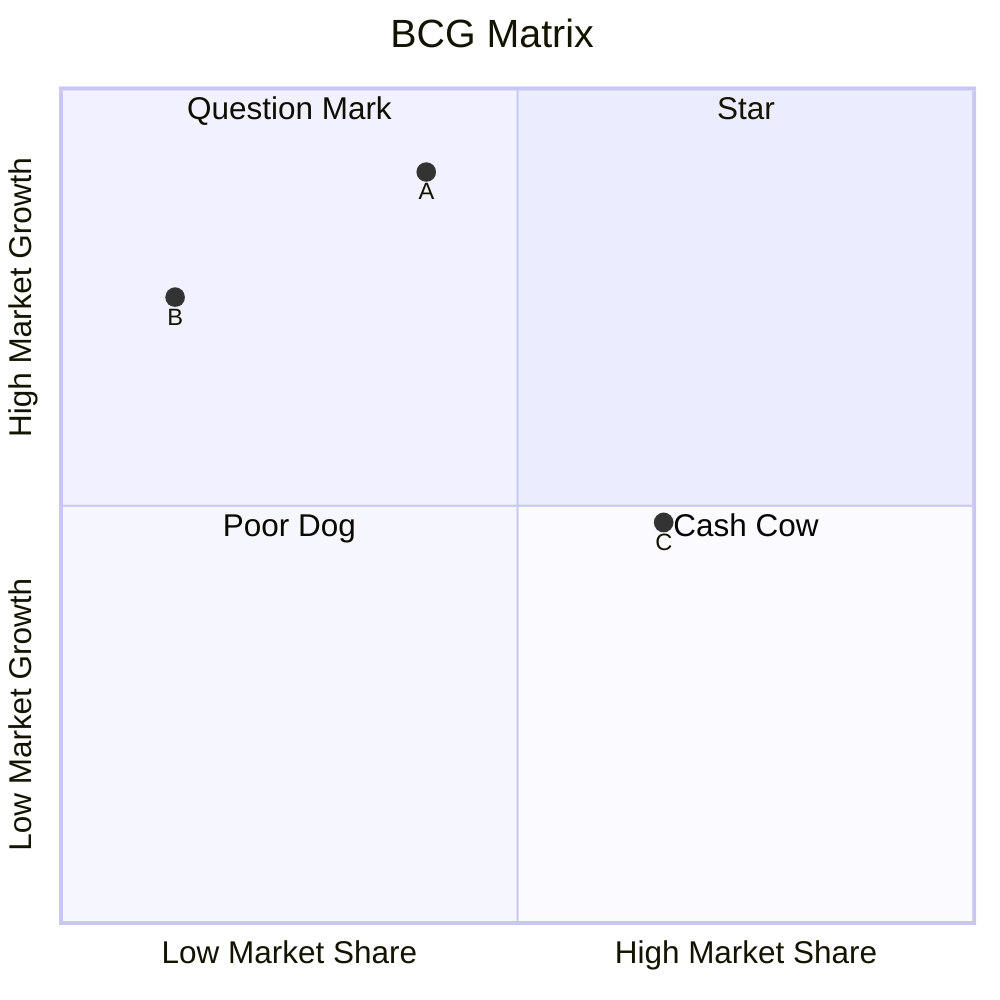

**Aufgaben:**
> **任务：**

(a) Analysieren Sie die gegenwärtige Situation des Unternehmens mithilfe der BCG-Matrix.
(b) Geben Sie für jedes einzelne Produkt eine strategische Empfehlung.
> (a) 使用BCG矩阵分析企业当前的状况。  
> (b) 为每个单独的产品提出战略建议。

Question Mark: Investition
Star: Investition !!!
Cash Cow: Erhaltungsinvestition. Der Buchwert beleibt gleich.
Poor Dog: Desinvestition.

Multiple-Choice-Fragen zur BCG-Matrix

1. Was bedeutet die Abkürzung "BCG" in BCG-Matrix?
    (a) Business Consulting Group
    (b) Boston Consulting Group
    (c) Business Control Group
    (d) Boston Control Group
2. Welche zwei Hauptfaktoren werden in der BCG-Matrix berücksichtigt?
    (a) Umsatz und Gewinn
    (b) Marktwachstum und relativer Marktanteil
    (c) Produktqualität und Kundenzufriedenheit
    (d) Investitionen und Rendite
3. Welches der folgenden Produkte würde am ehesten als "Cash Cow" bezeichnet werden?
    (a) Ein neues, innovatives Smartphone-Modell
    (b) Eine etablierte Waschmaschinenmarke
    (c) Ein experimentelles Elektroauto
    (d) Eine veraltete Softwareanwendung
4. Welche Strategie wird üblicherweise für "Question Marks" empfohlen?
    (a) Abschöpfungsstrategie
    (b) Desinvestitionsstrategie
    (c) Investitionsstrategie
    (d) Wachstumsstrategie
5. In welchem Quadranten der BCG-Matrix befinden sich Produkte mit hohem Marktwachstum und hohem relativen Marktanteil?
    (a) Stars
    (b) Cash Cows
    (c) Poor Dogs
    (d) Question Marks

Lösung:

1. b
2. b
3. b
4. c
5. a

#### 5.4.2 Ein Beispiel für Beschaffung - Die Losgrößenformel von Harris und Andler - Die optimale Bestellmenge

Das Problem der optimalen Bestellmenge geht auf ein Problem der Produktionstheorie zurück, das sich mit der optimalen Losgröße eines Fertigungsloses bei Umrüstkosten beschäftigt. Umrüstkosten sind Kosten, die beim Neueinrichten einer Maschine entstehen, und ein Produktionslos ist eine bestimmte Menge Produkte, die ohne Umrüstung auf einer Maschine produziert werden kann. Das Problem wurde zuerst von dem amerikanischen Betriebswissenschaftler Ford W. Harris 1913 beschrieben und ist im deutschen Sprachraum durch Kurt Andler 1929 bekannt gemacht worden.
> 最优订购量的问题可以追溯到生产理论中的一个问题，该问题涉及在存在调整成本的情况下确定生产批次的最优批量。调整成本是指在重新设置机器时产生的成本，而生产批次是指可以在不调整机器的情况下生产的一定数量的产品。该问题最早由美国管理科学家福特·W·哈里斯（Ford W. Harris）于1913年提出，并于1929年通过库尔特·安德勒（Kurt Andler）在德语地区传播开来。

**Wichtige Prämissen:**

1. Es handelt sich um ein Unternehmen mit einer einstufigen Einproduktfertigung.
2. Die Beschaffungsplanung erfolgt für ein Jahr.
3. Der Bedarf an Produktionsgütern in dieser Periode ist bekannt.
4. Die fixen Bestellkosten z.B. Kosten für die Bearbeitung der Bestellung, für den Transport z.B. Lohn des Fahrers, Benzin, Transportversicherung etc. sind bekannt.
5. Die fixen Lagerkosten z.B. Abschreibung oder Miete des Lagers, Lohn des Lageristen, Heizung etc. sind bekannt.
6. Der Preis bleibt innerhalb des Betrachtungszeitraumes immer gleich. Es gibt keine Mengenrabatte für große Bestellmengen.
7. Die Beschaffungsgeschwindigkeit ist unendlich groß.
8. Die Bestellung ist in jeder Höhe sofort lieferbar.
9. Eine neue Lieferung trifft erst ein, wenn das Lager vollständig leer ist.
10. Die Produktion und Entnahme aus dem Lager erfolgen kontinuierlich (lineare Verbrauchs-funktion) und unterliegen keinen zeitlichen Schwankungen.
11. Während der Lagerung gibt es keine Verluste (kein verdorbenes Lagergut, kein Diebstahl usw.)
12. Das Lager und die Liquidität des Unternehmens sind unendlich groß.

> 1. 这是一个具有单阶段单产品生产的企业。
> 2. 采购计划是为期一年的。
> 3. 在该期间内的生产物资需求是已知的。
> 4. 固定的订购成本，例如订单处理费用、运输费用（如司机工资、燃油费、运输保险等）是已知的。
> 5. 固定的库存成本，例如仓库折旧或租金、仓库管理员工资、供暖费用等是已知的。
> 6. 在观察期内价格始终保持不变。对于大批量订单没有数量折扣。
> 7. 采购速度无限快。
> 8. 订单可以以任何数量立即交付。
> 9. 新的货物只有在库存完全清空后才会到达。
> 10. 生产和库存提取是连续进行的（线性消耗函数），且不受时间波动影响。
> 11. 在存储期间没有损失（没有变质的库存货物、没有被盗等）。
> 12. 企业的库存容量和流动资金是无限大的。

Modellkritik (Welche Modellprämissen werden kritisiert?)

1. Das Verbrauchsverhalten ist nicht linear. (Prämisse 10)
2. Der Preis variiert innerhalb einer Periode nicht nur in Abhängigkeit von der Bestellmenge, sondern auch in Abhängigkeit von anderen Faktoren.(Prämisse 6)
3. Die Beschaffungsgeschwindigkeit ist nicht unendlich groß.(Prämisse 7)
4. Die Ermittlung der Fixkosten einer Bestellung ist schwierig.(Prämisse 4)
5. Der Lieferant kann nicht unendlich große Mengen liefern.(Prämisse 8)
6. Das Unternehmen kann nicht unendlich große Mengen bezahlen (Liquiditätsengpässe)(Prämisse 12)

> 模型批评（哪些模型假设受到批评？）
> 
> 1. 消费行为不是线性的。（假设 10）
> 2. 价格在一个周期内不仅取决于订购量，还取决于其他因素。（假设 6）
> 3. 采购速度并非无限快。（假设 7）
> 4. 确定订单的固定成本是困难的。（假设 4）
> 5. 供应商无法交付无限大的数量。（假设 8）
> 6. 企业无法支付无限大的数量（流动性不足）。（假设 12）

Bei der Beschaffung gibt es zwei gegenläufige Kostenfunktionen, die **Beschaffungskostenfunktion** in Abhängigkeit von der Bestellmenge und die **Lagerkostenfunktion** in Abhängigkeit von der Bestellmenge. Beide Funktionen setzen sich aus einem **fixen (nicht abhängig von der Bestellmenge)** und einem **variablen Anteil (abhängig von der Bestellmenge)** zusammen.

$\text{Gesamt Kosten}_\text{Bestellmenge} = \text{BK}_\text{Bestellmenge}+ \text{LK}_\text{Bestellmenge}$
$\text{Gesamt Kosten}_\text{Bestellmenge} = \text{Menge}* \text{Preis}+\text{Kosten}_\text{fB}*\text{n}+\text{Kosten}_\text{fL}+\frac{1}{2}*\text{Bestellmenge}*\text{Preis}*\text{Lagerhaltungszinshatz}$
$\text{Gesamt Kosten}_\text{Bestellmenge} = \text{Menge}* \text{Preis}+\text{Kosten}_\text{fB}*\frac{\text{Menge}}{\text{Bestellmenge}}+\text{Kosten}_\text{fL}+\frac{1}{2}*\text{Bestellmenge}*\text{Preis}*\text{Lagerhaltungszinshatz}$

$\frac{d\text{Gesamt Kosten(Bestellmenge)}}{d\text{Bestellmenge}}=-\text{Kosten}_\text{fB}*\frac{\text{Menge}}{\text{Bestellmenge}^2}+\frac{1}{2}*\text{Preis}*\text{Lagerhaltungszinshatz}$
$\text{Kosten}_\text{fB}*\frac{\text{Menge}}{\text{Bestellmenge}^2}=\frac{1}{2}*\text{Preis}*\text{Lagerhaltungszinshatz}$
$2\text{Kosten}_\text{fB}*\frac{\text{Menge}}{\text{Preis}*\text{Lagerhaltungszinshatz}}=\text{Bestellmenge}^2$
$\text{Bestellmenge}=\sqrt{\frac{2*\text{Kosten}_\text{fB}*\text{Menge}}{\text{Preis}*\text{Lagerhaltungszinshatz}}}$
$\text{Bestellmenge}=\sqrt{\frac{200\%*\text{Kosten}_\text{fB}*\text{Menge}}{\text{Preis}*\text{Lagerhaltungszinshatz}}}$

Der fixe Anteil der Beschaffungskosten sind die Materialkosten für ein Jahr, dem Produkt aus Preis und Menge an Material für ein Jahr. Der Preis ändert sich in Abhängigkeit von der Bestellmenge nicht. Der variable Anteil der Beschaffungskosten sind die gesamten Bestellkosten. Sie sind das Produkt aus den fixen Bestellkosten, die sich pro Bestellung nicht verändern, und der Anzahl der Bestellungen pro Jahr. Wenn kleine Mengen bestellt werden, dann muss häufig bestellt werden und damit steigen die gesamten Bestellkosten in diesem Jahr. Wenn große Mengen bestellt werden, dann sinken die gesamten Bestellkosten dieses Jahres.
> 采购成本的固定部分是全年材料成本，即价格与全年材料数量的乘积。价格不随订购量的变化而改变。采购成本的可变部分是总订购成本，它是固定订购成本（每次订购不变）与全年订购次数的乘积。如果订购小批量，则需要频繁订购，从而导致当年的总订购成本增加。如果订购大批量，则当年的总订购成本会减少。

Der fixe Anteil der Lagerkosten kann z.B. die Miete des Lagergebäudes oder der Lohn des Lageristen sein. Diese Kosten entstehen unabhängig davon, ob das Lager voll oder leer ist.
> 库存成本的固定部分可以是例如仓库租金或仓库管理员的工资。这些成本无论仓库是满的还是空的都会产生。

Die variablen Lagerkosten entstehen durch die Kosten der Kapitalbindung. Das Geld, das das Unternehmen für das Umlaufvermögen im Lager bezahlt hat, kann nicht mehr für eine andere Investition verwendet oder bei einer Bank mit Zins angelegt werden. Die Kosten für die Kapitalbindung berechnet man mit einem Lagerhaltungszinssatz in einer angenommenen Höhe.
> 可变库存成本则来源于资本占用成本。企业为库存中的流动资产支付的资金无法用于其他投资，也无法存入银行赚取利息。资本占用成本通过一个假定的库存持有利率来计算。如果订购和存储小批量，资本占用成本较低；如果订购和存储大批量，资本占用成本增加，从而导致总库存成本上升。虽然大量库存可以使企业免受供应风险的影响，但由于资本占用成本较高，这种做法被认为对企业不利。

Wenn kleine Mengen bestellt und gelagert werden, dann sind die Kapitalbindungskosten gering, wenn große Mengen bestellt und gelagert werden, steigen die Kapitalbindungskosten und damit die gesamten Lagerkosten. Eine umfangreiche Lagerhaltung macht das Unternehmen zwar unabhängig von Lieferrisiken, gilt aber aufgrund der Kapitalbindungskosten als nachteilig für ein Unternehmen.
> 当订购和储存小批量时，资金占用成本较低；而当订购和储存大批量时，资金占用成本就会上升，从而导致总库存成本增加。虽然大规模的库存管理使企业不受供应风险的影响，但由于资金占用成本的原因，这被认为对企业是不利的。

Mit Hilfe des Modells soll nun die optimale Bestellmenge berechnet werden. Bei der optimalen Bestellmenge erreicht die Gesamtkostenfunktion als Summe der Beschaffungs- und der Lagerkostenfunktion ihr Minimum.
> 现在，通过使用这个模型来计算最佳订购量。在最佳订购量时，总成本函数（即采购成本函数和库存成本函数的总和）达到其最小值。

#### 5.4.5 Ein Beispiel für das externe Rechnungswesen - Die Abschreibung

Die Abschreibung ist **der Wertverzehr eines Anlagegutes über die geplante Nutzungsdauer hinweg**.Nur selten entspricht die geplante Nutzungsdauer der realen Nutzungsdauer. Wenn das Anlagegut z.B. vorzeitig kaputt geht, muss es durch eine Sonderabschreibung aus dem Anlagevermögen gelöscht werden. Ist die Nutzungsdauer üblicherweise länger, bleibt das Anlagegut mit einem Erinnerungswert von einem Euro in den Büchern und kann weiterhin Nutzungsströme abgeben, obwohl es bereits abgeschrieben ist. Der Nutzwert, der dann noch in dem Anlagegut enthalten ist, gilt als stille Reserve. Die stille Reserve wird aufgedeckt, wenn das Anlagegut auf dem Markt einen höheren Preis erzielt als der Buchwert. Somit ist die stille Reserve also die Differenz zwischen dem Buchwert und dem Nutzwert oder die Differenz zwischen dem Buchwert und dem Marktpreis.
> 折旧是一项固定资产在其计划使用寿命内的价值损耗。计划使用寿命很少与实际使用寿命相符。例如，如果固定资产提前损坏，就必须通过特别折旧从固定资产中注销。如果使用寿命通常更长，固定资产会以1欧元的象征性价值保留在账簿中，并可以继续提供使用价值，尽管它已经完全折旧。此时固定资产中仍然包含的使用价值被视为隐藏储备。当固定资产在市场上获得的价格高于账面价值时，隐藏储备就会被揭示。因此，隐藏储备是账面价值与使用价值之间的差额，或者是账面价值与市场价格之间的差额。

Der Wertverlust ist am besten zu erfassen, wenn er an die tatsächliche Nutzung gekoppelt ist, z.B. kann ein Fahrzeug über die zurückgelegten Kilometer abgeschrieben werden. In einem Jahr, in dem das Fahrzeug oft eingesetzt wurde, ist der Abschreibungsbetrag dann höher als in einem Jahr, in dem das Fahrzeug wenig genutzt wurde. Dieses Verfahren kann z.B. auch angewandt werden für die Nutzung eines Kopierers, der die kopierten Seiten zählt oder für Maschinen, deren Maschinenlaufzeit bestimmt werden kann.
> 当价值损耗与实际使用情况挂钩时，最容易进行评估。例如，车辆可以根据行驶的公里数进行折旧。在使用频繁的一年中，折旧金额会高于使用较少的一年。这种方法也可以应用于计算复印机的使用情况（通过计数复印的页数）或确定机器运行时间的设备。

Oft ist das aber nicht möglich und so gibt es mehrere rechnerische Abschreibungsverfahren, die den Wert von Anlagegütern pauschal, d.h., unabhängig von der tatsächlichen Nutzung nach einem vorgegebenen Prinzip mindern, z.B. die lineare oder die geometrische Abschreibung.
> 然而，这种方法通常是不可行的，因此存在多种计算折旧的方法，这些方法按照预定原则统一减少固定资产的价值，即不依赖于实际使用情况，例如线性折旧法或几何折旧法。

Beispiel Abschreibung und Bildung stiller Reserven
> 折旧和隐藏储备形成的示例：

Eine Maschine wurde für 90 000 € erworben. Die geplante Nutzungsdauer beträgt 6 Jahre. Der Abschreibungssatz für die geometrische Abschreibung beträgt 30 %. Berechnen Sie die linearen und die geometrischen Abschreibungsbeträge und die entsprechenden Buchwerte. Nach welchem Jahr geht man von der geometrischen zur linearen Abschreibung über? (alle
Beträge in €)
> 一台机器以90,000欧元购入。计划使用寿命为6年。几何折旧的折旧率为30%。请计算线性折旧和几何折旧的金额以及相应的账面价值。在哪一年后应从几何折旧转为线性折旧？（所有金额单位为欧元）

||Linear Abschreibungsbetrag|Buchwert|Geometrischer Abschreibung|Buchwert|
|:--:|:--:|:--:|:--:|:--:|
|Anschaffungskosten||$90000$||$90000$|
|nach dem 1.Jahr|$15000$|$90000-15000=75000$|$27000$|$90000-27000=63000$|
|nach dem 2.Jahr|$15000$|$60000$|$18900$|$44100$|
|nach dem 3.Jahr|$15000$|$45000$|nach geometrischer Methode $13230<15000$, deshalb Methodenwechsel, $33075 \div 3=11025$|$33075$|
|nach dem 4.Jahr|$15000$|$30000$|$11025$|$22050$|
|nach dem 5.Jahr|$15000$|$15000$|$11025$|$11025$|
|nach dem 6.Jahr|$15000$|$1$|$11025$|$1$|

Linear:
$
\left\{
\begin{aligned}
y &= 90000-15000x \space (x \in [0,6)) \\
y &= 1 \space (x = 6)
\end{aligned}
\right.
$

Geometrischer:
$
\left\{
\begin{aligned}
y &= 90000 * (1-30\%)^x \space (x \in [0,3)) \\
y &= 33075-11025x \space (x \in [3,6)) \\
y &= 1 \space (x = 6)
\end{aligned}
\right.
$

> Warum ist die Fkt. ( $y = 90000 * (1-30\%)^x$ ) fallend in der Intervalle $[0,3)$ ?
> Um die Monotonie dieser Fkt. zu bestimmen, zuerst sollen wir wissen, was  die erste Ableitung von $y = 90000 * (1-30\%)^x $ ist.
> geg. $y=f(x)= 90000 * (1-30\%)^x = 90000 * 0.7^x$
> $u(x)=0.7^x \text{ //aber habe ich keine Ahnung, wie ich diese Fkt. ableiten kann}$
> $\ln(u(x))=x\ln(0.7) \Rightarrow u(x)=e^{\ln(u(x))}=e^{x\ln(0.7)}$
> $u(x)=a(b(x)),a(b)=e^b,b(x)=\ln(0.7)x$
> $\frac{da(b)}{db}=e^b,\frac{db(x)}{dx}=\ln(0.7)$
> $\frac{du(x)}{dx}=\frac{da(b)}{db}*\frac{db(x)}{dx}=e^{\ln(0.7)x}*\ln(0.7)$
> $\because f(x)=90000*u(x)$
> $\therefore f'(x)=90000*\frac{du(x)}{dx}=90000*e^{\ln(0.7)x}*\ln(0.7)$
> Wenn $x \in [0,3)$, $e^{\ln(0.7)x}>0,\ln(0.7)<0 \Rightarrow f'(x)=90000*e^{\ln(0.7)x}*\ln(0.7)<0$
> $\therefore y = 90000 * (1-30\%)^x \space (x \in [0,3))\text{ ist fallend in der Intervalle }[0,3) $

Die Abschreibungsbeträge der linearen Abschreibung bleiben immer gleich. Die Abschreibungsbeträge der geometrischen Abschreibung verringern sich immer weiter, erreichen aber nie Null. Deshalb ist es möglich, aus der geometrischen in die lineare Abschreibung zu wechseln, wenn der Abschreibungsbetrag der geometrischen Abschreibung kleiner als der lineare Abschreibungsbetrag ist.

### 5.5 Wiederholungsaufgaben

1. Vergleichen Sie die VWL und die BWL miteinander. Wählen Sie mindestens 6 Kriterien (Beispiele: Gegenstand, Ziel, Modelle, Beziehung zwischen Theorie und Praxis, Geschichte, Verhältnis des Gegenstandes zur Wissenschaft, Klassifikation der Produktionsfaktoren, Sicht auf das Unternehmen). Sie können auch eigene Kriterien wählen.

> ||BWL|VWL|
> |:--:|:--:|:--:|
> |Ziel|Ziele der `BWL` sind nicht nur die Beschreibung und Erklärung, sondern auch die konkrete Unterstützung der Entscheidungsprozesse in Unternehmen. |Sie untersucht damit gesamtwirtschaftliche Zusammenhänge, d.h. das Zusammenspiel von maximal vier hoch aggregierten Märkten (Arbeitsmarkt, Gütermarkt, Geldmarkt und Kapitalmarkt) innerhalb eines administrativ entstandenen Wirtschaftsraumes, meist eines Landes.|
> |Gegenstand|Unternehmen|Länder|
> |Modelle|BCG-Matrix, Die Optimal Bestellung, Das Handelsvertreter-Reisender-Problem(4P)|das neoklassische Synthesemodell(in Mikroökonomie), erweiterten Wirtschaftskreislauf|
> |Geschichte|nicht lang als ein Fach, aber schon lange existiert|nicht lang existiert, aber länger als ein Fach als BWL|
> |Sicht auf das Unternehmen| Die Betriebswirtschaftslehre konzentriert sich auf die Strukturen und Vorgänge innerhalb des Unternehmens und beurteilt die Beziehungen zu anderen Wirtschaftsobjekten aus der Sicht des Unternehmens bzw. des Unternehmers. Es existieren allerdings nach wie vor Definitionsprobleme.|"black box"(Als eine Einheit)|
>
> Warum ABWL studieren:
> 
>   - Die Mehrheit der Firmen produziert Produkte.
>   - Die wichtige Modelle sind in der Anteil der ABWL.

2. Lesen Sie die Studienangebote der Universität Leipzig zum Bachelor- und Masterstudium bzw. zum Diplomstudium auf dem Gebiet der Wirtschaftswissenschaften. Formulieren Sie ein Ziel für Ihr Studium und kombinieren Sie dazu einen möglichen Weg an der Universität Leipzig. (Sie verpflichten sich mit der Hausaufgabe nicht, an der Universität Leipzig zu studieren. Diese Übung soll als Beispiel verstanden werden.)

> Keine Ahnung

3. Zu berechnen sind jeweils die optimalen Bestellmengen, die zeitliche Reichweite der Bestellung und die Anzahl der Bestellung pro Jahr.
Für das erste Unternehmen gelten folgende Zahlen: Bestellkosten 360 €, Gesamtmenge an Produktionsmaterial 3200 Stück, Stückpreis 90 €, Lagerhaltungszinssatz 16%.
Für das zweite Unternehmen gelten folgende Zahlen: Bestellkosten 288 €, Gesamtmenge an Produktionsmaterial 100 Stück, Stückpreis 40 €, Lagerhaltungszinssatz 10%.

> | | Unternehmen 1 | Unternehmen 2 |
> |:--:|:--:|:--:|
> | Bestellkosten pro Bestellung (€) | 360 € | 288 € |
> | Gesamtmenge pro Jahr (Stück) | 3200 | 100 |
> | Stückpreis (€)| 90 € | 40 € |
> | Lagerhaltungszinshatz | 16 % | 10 % |
> 
> $\text{Bestellmenge}=\sqrt{\frac{2*\text{Kosten}_\text{fB}*\text{Menge}}{\text{Preis}*\text{Lagerhaltungszinshatz}}}$
> $\text{Bestellmenge}_1=\sqrt{\frac{2*360*3200}{90*0.16}}=400$
> $\text{Anzahl der Bestellung}_1=\frac{\text{Menge}}{\text{Bestellmenge}}=\frac{3200}{400}=8$
> $\text{zeitliche Reichweite einer Bestellung}_1=\frac{360}{\text{Anzahl der Bestellung}_1}=\frac{360}{8}=45$
> 
> $\text{Bestellmenge}_2=\sqrt{\frac{2*288*100}{40*0.1}}=120$
> $\text{Anzahl der Bestellung}_2=\frac{\text{Menge}}{\text{Bestellmenge}}=\frac{100}{120}=\frac{5}{6}=0,83$
> $\text{zeitliche Reichweite einer Bestellung}_2=\frac{360}{\text{Anzahl der Bestellung}_2}=\frac{360}{\frac{5}{6}}=433,73$
> Antwortsatz. Die optimalen Bestellmengen von Unternehmen 1 ist 400 Stücke und die zeitliche Reichweite der Bestellung sowie die Anzahl der Bestellung pro Jahr sind 45 und 8. Die optimalen Bestellmengen von Unternehmen 2 ist 120 Stücke und die zeitliche Reichweite der Bestellung sowie die Anzahl der Bestellung pro Jahr sind 433,73 und 0,83.

4. Zur Harris-Andler-Formel: Das Minimum der Gesamtkostenfunktion liegt normalerweise nicht bei der Menge, bei der sich die Beschaffungskostenfunktion und die Lagerkostenfunktion schneiden. Warum nicht?

> Antwortsatz. Die Bestellkostenkurve fällt hyperbolisch ab, da bei größeren Bestellmengen seltener bestellt werden muss. Und gleichzeitig steigt die Lagerkostenkurve linear an, da bei größeren Bestellmengen mehr Waren gelagert werden müssen. Die gesamte Kosten ist die Summe dieser zwei Kurven.

5. Der Reisende einer Firma erhält für den Vertrieb von neuartigen kleinen Staubsaugern ein Fixum von 2200 € im Monat und eine Verkaufsprovision von 3% vom Umsatz. Für den Vertrieb durch einen Handelsvertreter müsste man diesem eine Umsatzprovision von 14% bezahlen. Der Verkaufspreis des Staubsaugers beträgt 160 € und der Manager geht von einem Absatz von 600 Stück im Monat aus.
(a) Sollte der Marketingleiter einen Reisenden oder einen Handelsvertreter mit dem Vertrieb beauftragen?
(b) Bei welcher Menge verdienen Reisender und Handelsvertreter gleich viel?
(c) Wie hoch müsste die Umsatzprovision des Handelsvertreters sein, wenn er bei einem Absatz von 600 Stück genauso viel verdienen soll wie der Reisende?
(d) Ist es einfach für den Marketingleiter, einen Handelsvertreter zu den Konditionen von (c) zu finden? Begründen Sie Ihre Antwort.

> (a) $\text{Kost}_\text{Reisende}=\text{Kosten}_\text{fix}+\text{Preis}*\text{Menge}*3\%= 2200 + 600 * 160 = 5080 \text{€}$
> $\text{Kost}_\text{Handelsvertreter}=\text{Preis}*\text{Menge}*14\%=14\% * 600 * 160 = 13440 \text{€} > 5080\text{€}$
> Antwortsatz. Deshalb sollte der Marketingleiter einen Handelsvertreter mit dem Vertrieb beauftragen.
>
> (b) $\text{Kost}_\text{Reisende}=\text{Kost}_\text{Handelsvertreter} \Rightarrow 2200+3\% * \text{Menge} * 160 = 14\% * \text{Menge} * 160 $
> $\Rightarrow x=125$
> Antwortsatz. Wenn beiden verkaufen 125 Stücke, verdienen sie gleich.
>
> (c)  $\text{Kost}_\text{Reisende}=\text{Kosten}_\text{fix}+\text{Preis}*\text{Menge}* \text{Umsatzprovision} $
> $\text{Kost}_\text{Handelsvertreter}=\text{Preis}*\text{Menge}*\text{Umsatzprovision}$
> $\because \text{Preis}=160,\text{Menge}=600$
> $\therefore 2200 + 160*600*3\%=160*600*x \Rightarrow x=\frac{127}{2400} \approx 5.2\% $
> Antwortsatz. Die Umsatzprovision des Handelsvertreter sollte ungefähr 5,2% sein.
>
> (d) Antwortsatz. Nicht so einfach, weil der Handelsvertreter hat kein fixe Löhne bekommt und normalerweise eine höher Erwartung auf seinen Einkommen hat und in diesem Fall soll der Handelsvertreter die Risiken selbst nehmen.

6. Ein Bierbrauer plant eine Betriebsgründung und möchte einen Kredit bei der *Kreditanstalt für Wiederaufbau* beantragen. Dafür muss er einen Finanzierungsplan erstellen. In seine Betrachtung bezieht er folgende Kosten / Aufwände ein: Brauanlage 40.000 €, Verpackungsanlage 10.000 € (BGA), Miete für ein kleines Restaurant 8.000 €/Monat, Personalaufwand 9.000 €/Monat, Materialkosten 27.000 €/Monat, davon plant er einmalig zusätzlich 20% für den Aufbau eines eisernen Bestandes ein, Betriebs- und Geschäftsausstattung (ohne die Verpackungsanlage) 75.000 €, Energieaufwand 200 €/Tag, Produktionsgebäude 450.000 €, Lieferfahrzeug 70.000 €. Der Bierbrauer rechnet mit einer Produktionszeit von 10 Tagen, mit einer durchschnittlichen Lagerdauer der fertigen Biere von 25 Tagen und mit einem durchschnittlichen Zahlungsziel von 14 Tagen.
(a) Berechnen Sie den Finanzierungsbedarf des Bierbrauers für die Gründung des Unternehmens bis zu dem Zeitpunkt, an dem das Unternehmen wieder liquide ist.
(b) Schreiben Sie eine Bilanz. Der Bilanzstichtag soll der Zeitpunkt sein, an dem die Bank einen Kredit von 300 000 € ausgezahlt hat, alle Anlagegüter und Faktoren des Finanzplanes in (a) bezahlt sind und keine Liquiditätsreserve mehr vorhanden ist.

> (a) $\text{Finanzierungsbedarf}_\text{Bierbrauer}=\text{AV}+\text{eisernen Bestand}+\text{Kosten}=\text{Brauanlage}+\text{Verpackungsanlage}+\text{Betriebs- und Geschäftsausstattung}+\text{Produktionsgebäude}+\text{Lieferfahrzeug} + \text{eisernen Bestand}+\text{Kosten}$ // Hier gibt es aber kein Miete oder Energieaufwand.
> 
> |Anteil des Finanzierungsbedarfs(AV+Eiseren Bestand)|Preis(€)|
> |:--:|:--:|
> |Brauanlage|$40.000$|
> |Verpackungsanlage|$10.000$|
> |Betriebs- und Geschäftsausstattung|$75.000$|
> |Produktionsgebäude|$450.000$|
> |Lieferfahrzeug|$70.000$|
> |Aufbau eines eisernen Bestandes|$20\%*27.000=5.400$|
> |Summe|$650.400$|
>
> |Kosten|Preis(€/Monat)|
> |:---:|:---:|
> |Miete für Restaurant|$8.000$|
> |Personalaufwand|$9.000$|
> |Materialkosten|$27.000$|
> |Energieaufwand|$200*30=6000$|
> |Gesamt|$50000$|
>
> $\text{Zeit}=\text{Produktionszeit}+\text{Lagerdauer}+\text{Zahlungszeit}=10+25+14=49$
> $\text{Kost}=\text{gesamte Kosten pro Monat}*30/\text{Zeit}=81666,67$
>
> $\text{Finanzierung}=\text{Summe}+\text{Kosten}=650.400+81.666,67=732066,67$
> 
> Antwortsatz. Der Finanzierungsbedarf des Bierbrauers für die Gründung des Unternehmens ist 732066,67 €.

> ||Aktiva|||Passiva||
> |:---:|:---:|:---:|:---:|:---:|:---:|
> |**AV**|Brauanlage|$40.000 \text{ €}$|**EK**||$677900-300000=377.400\text{ €}$|
> ||Verpackungsanlage BGA|$10.000 \text{ €}$ ||||
> ||Betriebs- und Geschäftsausstattung|$75.000 \text{ €}$||||
> ||Produktionsgebäude|$450.000 \text{ €}$||||
> ||Lieferfahrzeug|$70.000 \text{ €}$||||
> |**UV**|RHB(Materialkosten und eisern Bestand)|$27.000 \text{ €/Monat}*(1+20\%)=32400\text{ €}$|**FK**|Kredit(Verbindlichkeiten)|$300.000 \text{ €}$|
> |Summe||$677.400\text{ €}$|Summe||$677.400\text{ €}$|

7. Ein Unternehmen hat eine Maschine im Wert von 49 000 € gekauft. Es sollen nun die Abschreibungssätze für eine lineare und eine geometrische Abschreibung mit 32% über sieben Jahre verglichen werden. Wann geht man von der geometrischen Abschreibung zur linearen Abschreibung über?

> ||Linear Abschreibungsbetrag (€) |Buchwert (€) |Geometrischer Abschreibung (€) |Buchwert (€) |
> |:--:|:--:|:--:|:--:|:--:|
> |Anschaffungskosten||$49000$||$49000$|
> |nach dem 1.Jahr|$49000 \div 7 =7000$|$49000-7000=42000$|$49000*32\%=15680$|$49000-15680=33320$|
> |nach dem 2.Jahr|$7000$|$35000$|$33320*32\%=10662.4$|$33320-10662.4=22657.6$|
> |nach dem 3.Jahr|$7000$|$28000$|$22657.6*32\% \approx 7250.43$|$22657.6-7250.43=15407.17$|
> |nach dem 4.Jahr|$7000$|$21000$|$15407.17*32\% \approx 4930.29<7000$||
> |nach dem 5.Jahr|$7000$|$14000$|||
> |nach dem 6.Jahr|$7000$|$7000$|||
> |nach dem 7. Jahr|$7000$|$1$|||
>
> Antwortsatz. Nach dem 4. Jahr geht man von der geometrischen Abschreibung zur linearen Abschreibung über.

## 7. Realer Markt und Marktmodell

### 7.1 Reale Märkte und der Begriff des Marktes

Brainstorming: Sammeln Sie Begriffe, die Märkte und Verkaufs- bzw. Kaufhandlung beschreiben.

Was?

- Aggregation
- Homogenität

Wo zu handeln?

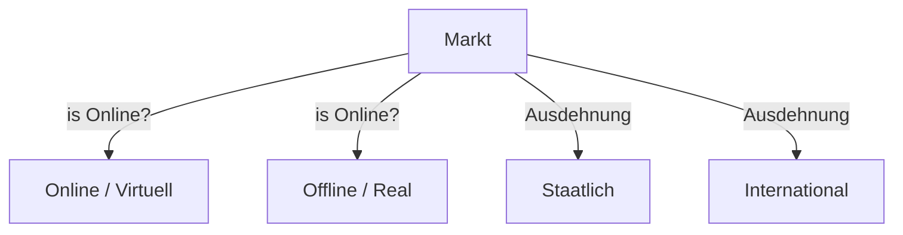

Was zu handeln?

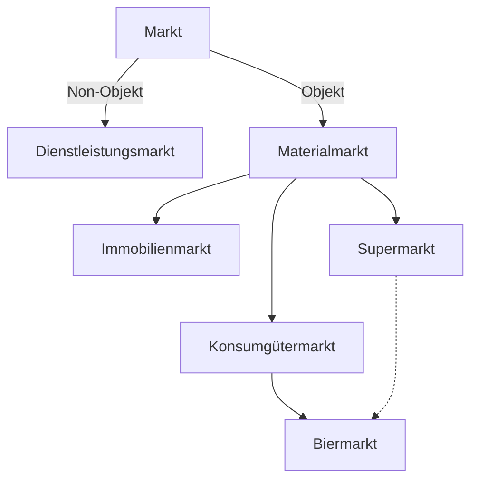

Welche Faktoren?

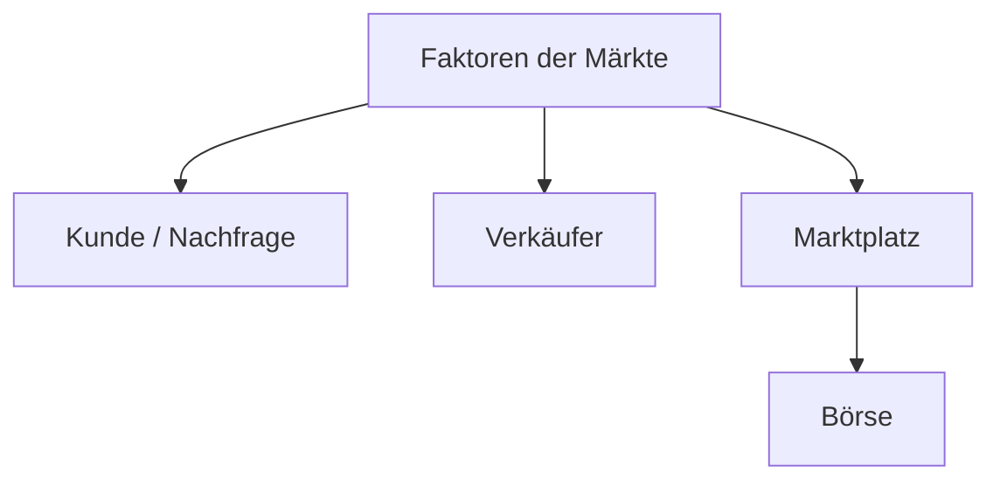

Wann?

Nach Öffnungszeit klassifiziert.

- pro Stunde
- pro Monat
- immer
- Saison

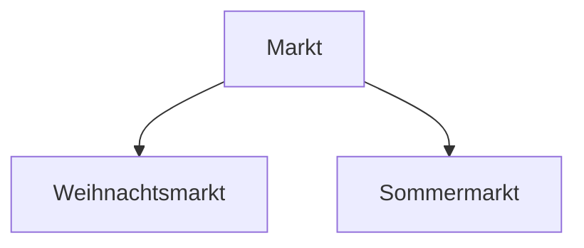

Wer?

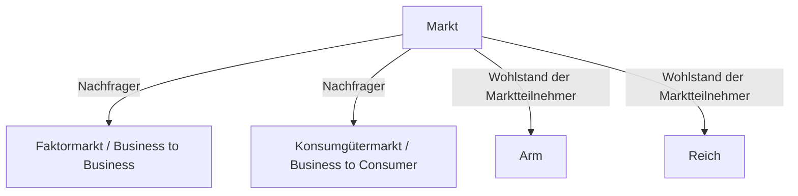

Wie?

- Preisbildung
  - Wer sitzt den Preis?
  - Wird gehandelt? (Wie?)
- Legalität?
  - Schwarzmarkt

- Staatseingriff?
- Beziehung zwischen Nachfrager und Anbieter?

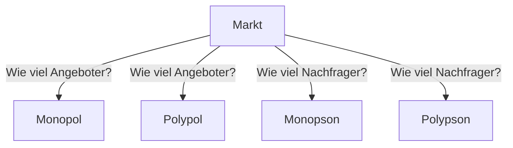

| Nachfrager\\Angeboter | Viel | Wenig | Ein |
| :--: | :--: | :--: | :--: |
|**Viel**|Polypol|beschränktes Polypol|Monopol|
|**Wenig**|Oligopson|zweiseitiges Oligopol|beschränktes Monopson|
|**Ein**|Monopson|beschränktes Monopson|Monopol|

$\text{(a) }
\left\{
\begin{aligned}
\text{m}_\text{N}(\text{p}) &= -\frac{1}{2}\text{p} + 350 \\
\text{m}_\text{A}(\text{p}) &= 2\text{p} -250
\end{aligned}
\right.
$

> $\text{p}_\text{N}(\text{m})=-2\text{m}+700$
> $\text{p}_\text{A}(\text{m})=-\frac{1}{2}\text{m}_\text{A}+125$
> $-2\text{m}+700=-\frac{1}{2}\text{m}_\text{A}+125 \Rightarrow \text{m}_\text{gg}=230,\text{p}_\text{gg}=240,\text{m}_\text{v}=55200$

$\text{(b) }
\left\{
\begin{aligned}
\text{m}_\text{A}(\text{p}) &= \text{p} - 20 \\
\text{p}(\text{m}_\text{N}) &= -\frac{1}{2}\text{m}_\text{N} +400
\end{aligned}
\right.
$

> $\text{p}(\text{m}_\text{A})=\text{m}_\text{A}+20$
> $\text{p}(\text{m}_\text{N}) = -\frac{1}{2}\text{m}_\text{N} +400$
> $\text{m}_\text{A}+20=-\frac{1}{2}\text{m}_\text{N} +400 \Rightarrow \text{m}_\text{gg}=253,33;\text{p}_\text{gg}=273,33;\text{m}_\text{v}=69242,68$

$\text{(c) }
\left\{
\begin{aligned}
\text{m}_\text{N}(\text{p}) &= 30-\text{p} \\
\text{p}(\text{m}_\text{A}) &= \frac{1}{0,1}\text{m}_\text{A}
\end{aligned}
\right.
$

> $\text{p}_\text{N}=30-\text{m}_\text{N}$
> $\text{p}(\text{m}_\text{A}) = \frac{1}{0,1}\text{m}_\text{A}$
> $30-\text{m}_\text{N}=\frac{1}{0,1}\text{m}_\text{A} \Rightarrow \text{m}_\text{gg}=2,73;\text{p}_\text{gg}=27,27;\text{m}_\text{v}=74,44$

$\text{(d) }
\left\{
\begin{aligned}
\text{p}(\text{m}_\text{N}) &= 1080-12\text{m}_\text{N}^2 \\
\text{p}(\text{m}_\text{A}) &= 405+15\text{m}_\text{A}^2
\end{aligned}
\right.
$

> $\text{p}(\text{m}_\text{N}) = \text{p}(\text{m}_\text{A}) = \text{p}_\text{gg} \land \text{m}_\text{N} = \text{m}_\text{A} = \text{m}_\text{gg}$
> $1080-12\text{m}_\text{gg}^2 = 405+15\text{m}_\text{gg}^2$
> $\text{m}_\text{gg} = 5$
> $\text{p}_\text{gg} = 1080-12\text{m}_\text{gg}^2 = 1080-12 \cdot 25 = 780$
> $\text{m}_\text{v} = \text{m}_\text{gg} \cdot \text{p}_\text{gg} = 5 \cdot 780 = 3900$

$\text{(e) }
\left\{
\begin{aligned}
\text{m}_\text{N}(\text{p}) &= 80-4\text{p} \\
\text{m}_\text{A}(\text{p}) &= 12
\end{aligned}
\right.
$

> $\text{p}_\text{N}(\text{m}_\text{N}) = \frac{80-\text{m}_\text{N}}{4}$
> $\text{m}_\text{A}(\text{p}) = 12$
> $\text{m}_\text{N} = \text{m}_\text{A} = \text{m}_\text{gg} = 12$
> $\text{p}_\text{gg} = \frac{80-\text{m}_\text{gg}}{4} = \frac{80-12}{4} = 17$
> $\text{m}_\text{v} = \text{m}_\text{gg} \cdot \text{p}_\text{gg} = 12 \cdot 17 = 204$

$\text{(f) }
\left\{
\begin{aligned}
\text{m}_\text{N}(\text{p}) &= -2\text{p}+30 \\
\text{m}_\text{A}(\text{p}) &= (\text{p}-3)^2
\end{aligned}
\right.
$

> $\text{p}_\text{N}(\text{m}_\text{N}) = \frac{30-\text{m}_\text{N}}{2}$
> $\text{p}_\text{A}(\text{m}_\text{A}) = \sqrt{\text{m}_\text{A}} + 3$
> $\text{m}_\text{N} = \text{m}_\text{A} = \text{m}_\text{gg} \land \text{p}_\text{N} = \text{p}_\text{A} = \text{p}_\text{gg}$
> $\frac{30-\text{m}_\text{gg}}{2} = \sqrt{\text{m}_\text{gg}} + 3$
> $\text{m}_\text{gg}^2-25\text{m}_\text{gg}+144 = 0$
> $\text{m}_\text{gg} = 16$
> $\text{p}_\text{gg} = \frac{30-\text{m}_\text{gg}}{2} = \frac{30-16}{2} = 7$
> $\text{m}_\text{v} = \text{m}_\text{gg} \cdot \text{p}_\text{gg} = 16 \cdot 7 = 112$

$\text{(g) }
\left\{
\begin{aligned}
\text{m}_\text{N}(\text{p}) &= 100-5\sqrt{\text{p}} \\
\text{m}_\text{A}(\text{p}) &= -20+\frac{1}{4}\text{p}
\end{aligned}
\right.
$

> $\text{p}_\text{N}(\text{m}_\text{N}) = (\frac{100-\text{m}_\text{N}}{5})^2$
> $\text{p}_\text{A}(\text{m}_\text{A}) = 4\text{m}_\text{A} + 80$
> $\text{m}_\text{N} = \text{m}_\text{A} = \text{m}_\text{gg}\land \text{p}_\text{N} = \text{p}_\text{A} = \text{p}_\text{gg}$
> $(\frac{100-\text{m}_\text{gg}}{5})^2 = 4\text{m}_\text{gg} + 80$
> $\text{m}_\text{gg} = 100 + 20\sqrt{2} \approx 128.28 \space (\text{m}_\text{gg}>0)$
> $\text{p}_\text{gg} = 4\text{m}_\text{gg} + 80 = 4(100 + 20\sqrt{2}) + 80 = 480 + 80\sqrt{2} \approx 593.14$
> $\text{m}_\text{v} = \text{m}_\text{gg} \cdot \text{p}_\text{gg} = (100 + 20\sqrt{2})(480 + 80\sqrt{2}) = 76000 + 22400\sqrt{2} \approx 76080.61$

### 7.3 Marktversagen

#### 7.3.1 Externe Effekte oder Externalitäten

Externe Effekte liegen vor, wenn die Handlungen eines Wirtschaftsakteurs (Verursacher) wissentlich oder auch unwissentlich Kosten oder Erlöse bei anderen Wirtschaftsakteuren (Empfänger) verursachen, und damit den Nutzen / Gewinn des anderen Wirtschaftsakteurs beeinflussen, ohne dass dieser dafür eine Gegenleistung erbringen muss oder empfangen wird. Externe Effekte nach dieser Definition treten überall im Leben auf.
> 外部效应是指当一个经济主体（造成者）的行为有意或无意地给其他经济主体（接受者）带来成本或收益，从而影响其他经济主体的效用/利润，而这些受影响的经济主体无需为此提供或接受任何补偿。根据这个定义，外部效应在生活中无处不在。

Sie können unterteilt werden in:
> 外部效应可以分为:

1. Positive und negative externe Effekte
Positiv: Der Nutzen des Empfängers steigt, ohne dass er dem Verursacher dafür eine Zahlung leisten muss.
Negativ: Der Nutzen des Empfängers sinkt oder der Schaden des Empfängers steigt, ohne dass der Verursacher dafür eine Zahlung leisten muss.

> 1. 正面和负面外部效应
> 正面：接受者的效用增加，而无需向造成者支付任何费用。
> 负面：接受者的效用下降或损失增加，而造成者无需为此支付任何费用。

2. Einseitig und wechselseitig
Einseitige: Ein Wirtschaftsakteur ist Verursacher, ein anderer Wirtschaftsakteur Empfänger Wechselseitig: Jeder der beiden beteiligten Wirtschaftsakteure ist einerseits Verursacher eines externen Effektes, andererseits auch Empfänger. Ewig zitiertes Beispiel sind Imker und Obst-bauer. Der Obstbauer benötigt Bienen, die ihm der Imker liefert, um die Blüten zu bestäuben.
Der Imker kann mit seinen Bienen in der Nähe einer Obstplantage viel und guten Honig produzieren. Diese Effekte existieren oft in der Flora und Fauna unter dem Begriff Symbiose.

> 2. 单向和互惠外部效应
> 单向：一个经济主体是造成者，另一个经济主体是接受者。
> 互惠：参与的两个经济主体既是外部效应的造成者，又是接受者。一个经常被引用的例子是养蜂人和果农。果农需要养蜂人提供的蜜蜂来为花朵授粉。养蜂人可以在果园附近用他的蜜蜂生产大量优质的蜂蜜。这些效应在动植物界中经常以共生的形式存在。

3. Arten externer Effekte
Die Klassifikation externer Effekte ist in vielen Lehrbüchern sehr unterschiedlich dargestellt.
Nach der sehr weiten Definition oben kann man z.B. drei Merkhalsausprägungen unterscheiden, die wirtschaftswissenschaftliche Definition ist meist enger und bezieht sich nur auf die dritte Gruppe.

- (a) Pekuniäre externe Effekte
- - Pekuniäre externe Effekte wirken auf Märkten. Sie sind ein grundlegendes Instrument der Marktwirtschaft. Sie können in komparativ statischen Marktmodellen dargestellt werden. Wenn beispielsweise die Zahl der Nachfrager für ein Gut steigt, verschiebt sich die Nach-fragefunktion nach rechts und die Angebotsfunktion verändert sich zunächst nicht. Durch die Wirkung des Marktmechanismus kommt es zu einem neuen Gleichgewicht, der Preis steigt für alte und neue Nachfrager.
- (b) Psychologische externe Effekte
- - Psychologische externe Effekte wirken insbesondere auf die Nutzenfunktionen anderer Haushalte. Wenn der Nachbar (Verursacher) ein neues Auto gekauft hat, freue ich (Empfänger) mich, weil ich hoffe, dass ich auch mal mitfahren kann (positiv) oder ich bin neidisch (negativ). Es handelt sich um gefühlten Nutzen oder Schaden ohne finanzielle Auswirkung auf den Einzelnen und ohne Ausgleich. Negative psychologische externe Effekte treten immer auf, wenn Güter rival sind.
- (c) Technologische externe Effekte
- - Technologische externe Effekte senken oder steigern die Kosten der Herstellung von Gütern für die ganze Gesellschaft, ohne dass sie Kostenfunktionen der einzelnen Marktteilnehmer beeinflussen. Zwischen dem Verursacher und dem Empfänger des externen Effektes wirkt der Marktmechanismus nicht. Da die gesellschaftlichen Kosten oder Erlöse und damit die finanziellen Auswirkungen eines externen Effektes oft nicht genau bestimmbar sind, können die Grenzen zu den psychologischen externen Effekten fließend sein. Im Mittelpunkt der Analyse stehen negative technologische externe Effekte, die von Unternehmen verursacht werden, z.B. Luftverschmutzung, Wasserverschmutzung, Übernutzung natürlicher Reserven bei der Produktion von Gütern, also die Umweltproblematik. Die Tabelle zeigt typische negative technologische externe Effekte. Zum Beispiel: Das Schürfen von Bitcoin in China verbraucht große Mengen an Energie, was zu steigenden Strompreisen führt. Dies verdrängt die Stromnutzung anderer Industrien und beeinträchtigt die Entwicklung der lokalen Wirtschaft.

> 3. 外部效应的类型
在许多教科书中，外部效应的分类方式差异很大。根据上述广泛的定义，我们可以区分三种特征表现，而经济学的定义通常更为狭窄，仅涉及第三组。
> 
> - (a) 金钱性外部效应
> - - 金钱性外部效应在市场中发挥作用。它们是市场经济的基本工具，可以在比较静态的市场模型中表现出来。例如，当某种商品的需求者数量增加时，需求函数向右移动，而供给函数最初保持不变。通过市场机制的作用，会形成一个新的均衡，价格对新旧需求者都会上涨。
> - (b) 心理性外部效应
> - - 心理性外部效应主要影响其他家庭的效用函数。例如，当邻居（造成者）买了一辆新车，我（接受者）可能会感到高兴，因为我希望有机会搭乘（正面效应）；或者我可能会感到嫉妒（负面效应）。这涉及到感受到的效用或损害，不会对个人产生财务影响，也不会有补偿。当商品具有竞争性时，负面心理外部效应总是会出现。
> - (c) 技术性外部效应
> - - 技术性外部效应会降低或提高整个社会生产商品的成本，但不会影响单个市场参与者的成本函数。在外部效应的造成者和接受者之间，市场机制不起作用。由于社会成本或收益以及外部效应的财务影响通常难以准确确定，因此与心理性外部效应的界限可能会模糊。分析的重点是企业造成的负面技术性外部效应，例如空气污染、水污染、生产商品时过度使用自然资源，即环境问题。表格显示了典型的负面技术性外部效应。例如:在国内加密货币挖矿大量耗能，导致电价上升，挤占了其他产业的电力使用，影响了当地经济的发展。

||Empfänger: Unternehmen|Empfänger: Haushalt|
|:--:|:--:|:--:|
|Verursacher: Unternehmen, negativ|Wasserverschmutzung durch Industrie verursacht Kosten bzw.Gewinnausfall bei Fischereibetrieb|Wasserverschmutzung durch Industrie zerstört Bademöglichkeit, Familien müssen zum Baden weiter weg fahren (Kosten steigen)|

Negative technologische externe Effekte haben ihre Ursache fast immer in fehlenden oder nicht exakt zugeordneten Eigentumsrechten bei Gütern, bei denen Nutzer, die nicht zahlen wollen, nur schlecht vom Konsum ausgeschlossen werden können (Ausschließbarkeit) und rivalisierenden Nutzern beim Konsum von Gütern (Rivalität).
> 负面技术性外部效应几乎总是源于缺失或未被精确分配的产权，这种情况发生在以下商品中：不愿意付费的用户难以被排除在消费之外的商品（排他性），在商品消费中存在竞争性用户的商品（竞争性）

Daraus ergibt sich folgendes Problem: Der Wirtschaftsakteur betrachtet ein knappes Gut als ein freies Gut. Bei einem negativen externen Effekt spart der Verursacher Kosten, die auf die Gesellschaft abgewälzt werden. Bei einem positiven externen Effekt bezahlt der Empfänger des Gutes nichts an den Verursacher. Das bedeutet, dass bei einem negativen externen Effekt immer zu viel von dem Gut angeboten wird, bei einem positiven zu wenig. Die Verteilung der Güter erfolgt aus der Sicht der Gesellschaft nicht mehr paretooptimal (Siehe später).
> 从这种情况产生了以下问题：经济主体将一种稀缺商品视为免费商品。在负面外部效应中，造成者节省了成本，而这些成本被转嫁给了社会。在正面外部效应中，商品的接受者不向造成者支付任何费用。这意味着：
> 
> 1. 在负面外部效应的情况下，该商品总是供给过多
> 2. 在正面外部效应的情况下，该商品供给不足
> 
> 从社会的角度来看，商品的分配不再是帕累托最优的（详见后文）。

Zur Beseitigung negativer technologischer externer Effekte gibt es unterschiedliche Lösungsansätze:

1. moralische Appelle durch den Staat oder durch betroffene Bürger, Presse usw.
2. Käuferboykott
3. Gebote, Verbote, Auflagen durch den Staat
4. Steuern, Subventionen durch den Staat
5. Staat übernimmt die Reinigung
6. Verhandlungen zwischen den Verursachern und den Empfängern
7. Fusion
8. Zertifikate (Marktlösung)

> 解决负面技术性外部效应的不同方法：
> 
> 1. 国家、受影响的公民、媒体等发出道德呼吁
> 2. 消费者抵制
> 3. 国家制定法规、禁令、要求
> 4. 国家征税、提供补贴
> 5. 国家承担清理工作
> 6. 造成者与接受者之间进行谈判
> 7. 公司合并
> 8. 排放权证（市场解决方案）

Wenn negative technologische externe Effekte auftreten, geht es darum, Lösungen zu finden, die näher am Wohlfahrtsoptimum liegen, da sie die Existenz der Menschheit und der Erde gefährden. Diese können grundsätzlich durch Staatseingriff (Steuern, Verbote mit Strafen) angestrebt werden oder durch die Schaffung eines Marktes, nachdem man einem Wirtschaftsakteur Eigentumsrechte zugeteilt hat. Ziel ist es, negative externe Effekte zu internalisieren, d.h. als Kosten in die Kostenfunktionen der Marktakteure und damit auch in die Marktangebotsfunktion einfließen zu lassen.
> 当出现负面技术性外部效应时，需要寻找更接近福利最优的解决方案，因为这些效应威胁到人类和地球的存在。这些解决方案可以通过国家干预（如征税、禁令和惩罚）来实现，或者通过为某个经济主体分配产权来创造市场。目标是将负面外部效应内部化，即将其作为成本纳入市场参与者的成本函数，从而影响市场供给函数。

Bei einem Staatseingriff erhebt der Staat beispielsweise bei einem Chemiebetrieb, der giftiges Abwasser in einen Fluss einleitet, eine Steuer, mit der der Staat eine Filteranlage bauen kann, die die Verschmutzung beseitigt. Die Steuerlösung wurde von Pigou 1912 beschrieben (Pigousteuer). Wenn die Steuer höher ist als die Kostenersparnis des Unternehmens, ist das Unternehmen daran interessiert, die Filteranlage selbst zu bauen.
> 国家可以对向河流排放有毒废水的化工厂征税，用税收建设过滤设施以消除污染。这种税收解决方案由Pigou于1912年提出（庇古税）。如果税额高于企业的成本节省，企业就会有兴趣自行建设过滤设施。

Bei Lösungen ohne Staatseingriff muss zunächst ein Eigentumsrecht an dem sauberen Wasser für den Staat oder für einen Wirtschaftsakteur definiert werden. Wenn der Staat das Eigentumsrecht für sich definiert hat, kann er Umweltverschmutzern die Erlaubnis verkaufen, die Umwelt bis zu einem bestimmten Maße zu verschmutzen (ein Zertifikat). Die Unternehmen können dieses Zertifikat dann verkaufen und auch kaufen, es kommt zu einer Marktlösung.
Wenn der Staat einem Wirtschaftsakteur das Eigentum zuspricht, also dem Chemiebetrieb oder dem Fischereibetrieb, so kann entweder der Chemiebetrieb eine Zahlung vom Fischereibetrieb fordert, damit er eine Filteranlage bauen kann oder der Fischereibetrieb kann bei dem Chemieunternehmen eine Entschädigungszahlung für den entgangenen Gewinn durch Verhandlung einfordern. Die Verhandlungslösung beschreibt Coase 1960 in seinem Coase Theorem. Wenn die Forderung des Fischereibetriebs nach Entschädigung höher ist als die Kostenersparnis des Chemieunternehmens, ist das Unternehmen ebenfalls daran interessiert, die Filteranlage selbst zu bauen.
> 首先需要为国家或某个经济主体定义清洁水的产权。如果国家为自己定义了产权，可以向污染者出售一定程度的污染许可（证书）。企业可以买卖这些证书，形成市场解决方案。
> 如果国家将产权赋予某个经济主体（如化工厂或渔业公司），则可能出现以下情况：
> 化工厂要求渔业公司支付费用以建设过滤设施
> 渔业公司通过谈判向化工企业索要利润损失的赔偿金
> Coase在1960年的科斯定理中描述了谈判解决方案。如果渔业公司的赔偿要求高于化工企业的成本节省，化工企业也会有兴趣自行建设过滤设施。
> 注意:根据中国现行法律法规，个人和企业不能通过购买从国家手中获得水资源的所有权，但可以通过合法途径获得水资源的使用权。国内的水权交易主要涉及水资源使用权的转让，而非所有权的转让。《水权交易管理暂行办法》规定了可交易的水权范围、类型、交易主体和程序等内容。

Bei einer Fusion der beiden Unternehmen wird das Problem in ein Unternehmen verlagert.
Das kann nur funktionieren, wenn beide Teilunternehmen einen ähnlichen Beitrag zum Gewinn erwirtschaften können, denn sonst würde das weniger wirtschaftliche Teilunternehmen einfach geschlossen werden.
> 通过合并两家公司，问题被转移到一个企业内部。这只有在两个子公司能够为利润做出类似贡献时才能奏效，否则经济效益较差的子公司可能会被简单地关闭。

Die Internalisierung der externen Effekte führt zu steigenden Kosten für die Verursacher der Umweltverschmutzung. Die steigenden Kosten erhöhen die Angebotspreise, bei normal verlaufenden Nachfrage- und Angebotsfunktionen sinken dann die nachgefragten Mengen.
> 外部效应的内部化导致污染者的成本上升。成本上升会提高供给价格，在正常的需求和供给函数下，需求量会下降。

## 9. Die Produktionsfunktion

### 9.1 Die Produktion

Die Herstellung von Gütern erfordert den Einsatz von **Produktionsfaktoren** (Synonyme: Input, Inputmenge, Faktoren, Faktoreinsatz, Faktoreinsatzmenge, Inputfaktoren, Ressourcen, Produktionsgüter). Im Modell werden die Produktions Faktoren Arbeit, Boden und Kapital (VWL) bzw. Arbeit, Betriebsmittel und Werkstoffe (BWL) in der Weise planmäßig kombiniert, dass ein Output entsteht. Den Prozess der Umwandlung von Produktionsfaktoren in Güter nennt man **Produktion** (Synonyme: Technologie, Throughput usw.), das Ergebnis nennt man **der oder das Output** (Es existieren sehr viele Synonyme: Ausbringung, Ausbringungsmenge, Outputmenge, Produktionsmenge, betriebliche Leistungserstellung, Beschäftigung, Produktionsergebnis usw.)
> 生产商品需要使用**生产要素**。在模型中，生产要素包括劳动、土地和资本（国民经济学）或劳动、生产设备和原材料（企业经济学），这些要素以计划的方式结合，从而产生产出。将生产要素转化为商品的过程被称为**生产**，其结果被称为**产出**（存在很多同义词：产出、产出量、输出量、生产量、企业绩效创造、就业、生产结果等）。

Der Begriff „Produktion" kann ebenso wie andere Basisbegriffe der Wirtschaftswissenschaften unterschiedlich definiert werden. In der Mikroökonomik wird der Begriff sehr weit gefasst. **Produktion** umfasst hier alle menschlichen Tätigkeiten von der Rohstoffgewinnung über die Be- und Verarbeitung bis hin zur Verteilung der knappen Güter. Nur die Konsumtion, der Verbrauch der Güter, gehört nicht mehr dazu.
> "生产"这个概念，就像经济学中的其他基本概念一样，可以有不同的定义。在微观经济学中，这个概念的定义非常广泛。在这里，**生产**包括从原材料开采、加工和处理，直到稀缺商品的分配的所有人类活动。只有消费，即商品的使用，不属于生产的范畴。

Beispiele:

- Landwirtschaftlicher Betrieb: Das Zusammenwirken von Boden als Anbauboden, Arbeit des Landwirtes und Kapital (Landmaschinen, Saatgut) ergibt eine bestimmt Menge Weizen.
- Papierfabrik: Die Kombination von Boden als Standortboden, Arbeit der Arbeitnehmer und Kapital (Maschinen, Werkstoffe) ergibt eine bestimmte Menge Papier.
- Universität: Das Zusammenwirken der Leistungen des Professors, Wissen aus Büchern und anderen Medien, Zeit, einem realen oder virtuellen Ort führt zu einem gebildeten Studenten.

> 例如:
> 
> - 农业经营：土地作为耕地、农民的劳动和资本（农业机械、种子）的结合产生一定数量的小麦。
> - 造纸厂：土地作为厂址、工人的劳动和资本（机器、原材料）的组合产生一定数量的纸张。
> - 大学：教授的授课、来自书籍和其他媒体的知识、时间、以及实体或虚拟场所的共同作用，最终培养出一个受过教育的学生。

Zur wissenschaftlichen Beschreibung der Produktion wurde das Modell der Produktionsfunktionen entwickelt.
> 为了科学地描述生产过程，生产函数模型被开发出来。

### 9.2 Die Produktionsfaktoren in der VWL und in der BWL

#### 9.2.1 Die Klassifikation der Produktionsfaktoren aus der Sicht der VWL

Schreiben Sie Produktionsfaktoren, die notwendig sind, um ein Brot zu produzieren.
> 请列出生产一个面包所需的生产要素。

|Rohstoffe|Personal|Anlage|Lage|Methode/Wissenschaft|Energie|Zeit|
|:--:|:--:|:--:|:--:|:--:|:--:|:--:|
|Mehl, Wasser, Zucker, Milch, Hefe| Bäcker | Ofen, Tisch| Lager| Brotzubereitungsweisen|Storm, Holz|Zeit|

Der Blick der VWL auf die Produktionsfaktoren ist etwas anders als der Blick der BWL. Daraus ergeben sich andere Klassifikationsbedürfnisse.
> 国民经济学（VWL）和企业经济学（BWL）对生产要素的看法有所不同。这导致了不同的分类需求。

Unter Produktionsfaktoren versteht man alle materiellen und immateriellen Güter und Leistungen, die zur Produktion von Gütern eingesetzt werden. Es kann vorkommen, dass auch ungewünschte Produktionsfaktoren („Bads") in Produktionsprozesse eingehen, diese werden aber aus der Definition der Faktoren ausgeschlossen.
> 生产要素是指所有用于生产商品的物质和非物质商品及服务。在生产过程中，也可能会涉及一些不受欢迎的生产要素（“?我真不知道中文咋翻这个”），但这些因素被排除在生产要素的定义之外。

Auf die Klassiker der Volkswirtschaftslehre, Adam Smith und insbesondere David Ricardo geht die Einteilung der Produktionsfaktoren in Arbeit, Boden und Kapital zurück. In neueren Publikationen wird als vierter volkswirtschaftlicher Produktionsfaktor das Wissen erwähnt, das unabhängig vom Faktor Arbeit existieren kann (im Extremfall existieren Patente oder Bücher auch, wenn keine Menschen existieren). Aufgrund der wachsenden Bedeutung des Faktors betrachtet man auch die Energie als neuen fünften Produktionsfaktor.
> 生产要素的分类可以追溯到古典经济学的奠基人亚当·斯密，尤其是大卫·李嘉图，他们将生产要素划分为劳动、土地和资本。在较新的文献中，知识被提到作为第四种国民经济学的生产要素，它可以独立于劳动而存在（例如，在极端情况下，即使没有人类存在，专利或书籍也可以存在）。由于这一要素的重要性日益增加，能源也被视为第五种新的生产要素。

Der Faktor **Arbeit** ist gebunden an die Existenz des Menschen. Definiert wird sie als Einsatz der körperlichen und geistigen Fähigkeiten des Menschen mit dem Ziel, Einkommen zu erzielen. Die Produktion von Gütern, die der Bedürfnisbefriedigung dienen, nimmt zwar ihren Ausgang bei Rohstoffen, die der Natur entnommen sind, die Natur bietet jedoch nur in einem eingeschränkten Maße gebrauchsfertige Güter, zumeist bietet sie nur Rohstoffe oder Energie-quellen. Zur Erstellung der Güter muss menschliche Arbeitskraft aufgewandt werden. Arbeit im volkswirtschaftlichen Sinne ist homogen, das heißt, es wird nicht unterschieden zwischen verschiedenen Arten der Arbeit. Sie erfolgt außerdem ausschließlich zum Zweck der Einkommenserzielung, die Tätigkeit z.B. einer Person, die ihre Wohnung renoviert oder Essen für ihre Familie kocht ist im volkswirtschaftlichen Sinne keine Arbeit.
> 劳动因素与人类的存在密切相关。它被定义为人类运用身体和智力能力以获得收入的过程。虽然用于满足需求的商品生产始于从自然中获取的原材料，但自然界只能在有限程度上提供现成的商品，大多数情况下只提供原材料或能源。为了生产商品，必须投入人力劳动。从经济学角度来看，劳动是同质的，这意味着不区分不同类型的劳动。此外，劳动仅仅是为了获得收入而进行的，例如，一个人装修自己的住房或为家人做饭，从经济学的角度来看并不被视为劳动。

Die Klassifikation entstand in einer Zeit, in der die landwirtschaftliche Produktion eine hohe Bedeutung hatte, deshalb stand der Faktor **Boden** im Mittelpunkt der Betrachtung. Erste wissenschaftliche Darstellungen bezogen sich also auf den Produktionsfaktor Ackerboden (Boden als **Anbauboden**). Die wissenschaftliche Analyse wurde anschließend auf die Nutzung des Bodens in seiner Funktion als Rohstofflager (Boden als Abbaufläche oder Abbauboden) erweitert. Zum Produktionsfaktor Boden zählten nun auch Güter, die dem Boden entnommen werden konnten, also Bodenschätze. Während der Industrialisierung war die Produktion nicht mehr an eine bestimmte Bodenfläche gebunden, sondern gewann als Lage- oder Standortfaktor (Boden als Standortfaktor oder Standortboden) an Bedeutung. Als man hauptsächlich Wasserkraft zur Energiegewinnung nutzte, waren die Nutzungsrechte an einem Fluss von entscheidender Bedeutung. Heute werden verschiedene Energiequellen genutzt, eine höhere Bedeutung für die Lage eines Unternehmens hat heute z.B. die Nähe zu den Rohstoffquellen, die Nähe zu qualifizierten oder besonders billigen Arbeitskräften oder die Nähe zu einem Markt. Aufgrund des veränderten Einsatzes des Faktors Boden wurden die anderen Produktionsfaktoren im Laufe der industriellen Entwicklung zunehmend mobil. Aufgrund der Verknappung ursprünglich freier Produktionsmittel wie sauberer Luft oder sauberem Wasser musste der Produktionsfaktor Boden zum Produktionsfaktor Natur oder Umwelt erweitert werden.

Eine besondere Rolle spielt der Produktionsfaktor **Kapital**. Er ist, wenn man den einfachen Wirtschaftskreislauf als Modell aufgibt, der Teil des Produktionsergebnisses früherer Perioden, der die Grundlage der Produktion der gegenwärtigen Periode bildet. Kapital entsteht in der volkswirtschaftlichen Theorie aus der Kombination der zwei originären Faktoren Arbeit und Boden und wird deshalb als derivativer Faktor bezeichnet. Kapital kann einerseits als **Sach- bzw. Realkapital**, andererseits als **Geld- bzw. Finanzkapital** auftreten. Zum Sachkapital zählen bereits existierende Produktionsmittel, wie etwa Gebäude, Maschinen, Fahrzeuge, Werkzeuge usw. Grundlegende klassische und neoklassische Theorien sind güterwirtschaftliche Theorien, die den Tauschvorgang Gut gegen Gut analysieren, deshalb wird das Kapital in seiner Form als Geld- oder Finanzkapital in den Basismodellen meist vernachlässigt. Es birgt lediglich die Möglichkeit der Umwandlung in Realkapital.
> 这种分类产生于农业生产具有重要意义的时代，因此**土地**因素成为关注的焦点。最初的科学描述主要涉及耕地这一生产要素（土地作为**耕种土地**）。随后，科学分析扩展到土地作为原材料储存地的功能（土地作为开采区或开采土地）。现在，可以从土地中提取的商品，即矿产资源，也被计入土地生产要素。在工业化过程中，生产不再局限于特定的土地面积，而是作为位置或区位因素（土地作为区位因素或区位土地）变得更加重要。当主要使用水力发电时，对河流的使用权至关重要。如今，各种能源都被利用，企业选址更重要的因素包括靠近原材料来源、靠近合格或特别便宜的劳动力，或靠近市场。由于土地因素使用方式的变化，其他生产要素在工业发展过程中变得越来越具有流动性。由于原本免费的生产资源如清洁空气或清洁水的稀缺，土地生产要素必须扩展为自然或环境生产要素。

Die Produktionsfaktoren in der Volkswirtschaftslehre sind, da hoch aggregierte Zusammenhänge in relativ langen Zeiträumen betrachtet werden, zumindest in Grenzen substituierbar.
> 在国民经济学中，由于考察的是长时期内高度聚合的关系，生产要素至少在一定程度上是可以相互替代的。

Hauptsächlich wird der Einsatz des Faktors Arbeit in Kombination mit dem Faktor Kapital analysiert und z.B. nachgewiesen, dass die Bildung von Kapital die Produktivität des Faktors Arbeit erhöhen kann.
> 主要分析的是劳动要素与资本要素的结合使用，例如，可以证明资本的形成能够提高劳动要素的生产率。

#### 9.2.2 Die Klassifikation der Produktionsfaktoren aus der Sicht der BWL

In der Betriebswirtschaftslehre wird das Unternehmen nicht mehr als black box gesehen. Die Analyse des Unternehmens erfordert eine andere, teils allgemeinere, meist aber differenziertere Betrachtung der Produktionsfaktoren. Der Boden hat normalerweise für ein Unternehmen nur eine Bedeutung als Standortfaktor, das Kapital dagegen ist viel zu umfangreich, umfasst sowohl einen Nagel als auch eine Chemieanlage, und muss aus diesem Grund genauer differenziert werden, und auch Arbeit wird zum Zwecke der Analyse eines Unternehmens nicht mehr nur als homogen betrachtet. Allgemeine Akzeptanz fand dabei die Klassifikation von Erich Gutenberg (1951).
> 在经营管理学中，企业不再被视为一个黑匣子。对企业的分析需要一种不同的、部分更加普遍、但通常更加细致的生产要素观点。对于一个企业来说，土地通常只作为一个区位因素具有意义，而资本则范围广泛得多，既包括一枚钉子，也包括一个化工厂，因此必须更精确地加以区分。同样，为了分析企业，劳动力也不再仅仅被视为同质的。在这方面，埃里希·古滕贝格（Erich Gutenberg）1951年提出的分类方法获得了普遍认可。

Grundsätzlich unterscheidet Gutenberg nur noch Arbeit und Kapital. Die Arbeit wird in zwei Arten untergliedert, in die leitende Arbeit (Arbeit der Leitung) und in die ausführende Arbeit (Arbeit in der Produktion). Die Differenzierung erfolgt nach dem Kriterium, ob die Arbeit weisungsberechtigt ist, d.h., ob sie damit verbunden ist, Anordnungen zu erteilen oder nicht. Die leitende Arbeit, die Gutenberg als vierten (dispositiven) betrieblichen Produktionsfaktor betrachtet, umfasst die Leitung, Planung, Organisation und Kontrolle des Betriebsablaufes. Das ist die Aufgabe der Betriebs- oder Abteilungsleitung. Zur ausführenden Arbeit gehören z.B. Tätigkeiten eines Elektrikers, eines Buchhalters oder einer Verkäuferin. Es werden Arbeitsvorgänge erledigt, der Hauptinhalt der Arbeit besteht nicht darin, Anordnungen zu erteilen.
> 基本上，古滕贝格只区分劳动和资本。劳动分为两种类型：管理性劳动（领导工作的劳动）和执行性劳动（生产中的劳动）。这种区分是根据工作是否具有指挥权来进行的，即是否与发出指令相关。古滕贝格将管理性劳动视为第四种（处置性）企业生产要素，包括对企业流程的管理、规划、组织和控制。这是企业或部门管理的职责。执行性劳动则包括例如电工、会计或销售员的工作。执行性劳动涉及完成工作过程，工作的主要内容并不在于发出指令。

Das Kapital muss der VWL-Betrachtungsweise entgegen viel genauer klassifiziert werden. So vernachlässigt Gutenberg das Finanzkapital in seiner Klassifikation und unterteilt das Realkapital in Betriebsmittel und Werkstoffe. Betriebsmittel sind Faktoren, die über einen langen Zeitraum eingesetzt werden können (Gebrauchsgüter) und dabei einen Strom von Nutzungen abgeben. Ihr Wert wird über die geschätzte Nutzungsdauer hinweg abgeschrieben. Die Betriebsmittel werden im Anlagevermögen erfasst. Werkstoffe dagegen sind Verbrauchsgüter, also Produktionsmaterial. Sie werden im Umlaufvermögen erfasst.
> 资本必须比宏观经济学的视角进行更精确的分类。因此，古滕贝格在其分类中忽略了金融资本，并将实物资本划分为生产设备和原材料。生产设备是指可以长时间使用的要素（耐用消费品），并在使用过程中提供效用流。其价值根据估计的使用期限进行折旧，生产设备被记录在固定资产中。而原材料则是消耗品，即生产材料，它们被记录在流动资产中。

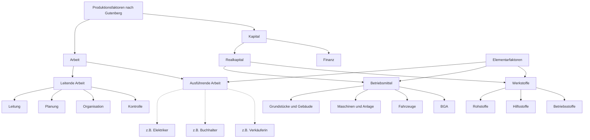

### 9.3 Das Modell der Produktionsfunktion

#### 9.3.1 Der Aufbau des Modells

Unter einer Produktionsfunktion versteht man den mathematischen Zusammenhang zwischen dem Input und dem Output, der eine bestimmte Zeitdauer lang gilt. Auch hier gibt es eine Anzahl von Synonymen: Ertragsfunktion, Produktionsgebirge, Ertragsgebirge usw. Die Faktormengen sind dabei die unabhängigen Variablen, die Menge des Outputs ist die abhängige Variable. Die Anzahl der Faktoren bestimmt dabei die Dimension der Produktionsfunktion. In der Realität führt der Einsatz vieler Faktoren zu einer bestimmten Menge eines oder einiger Outputs in einem Unternehmen. Grafisch darstellbar sind allerdings nur Produktionsprozesse, bei denen maximal zwei Inputs zur Erzeugung eines Outputs führen.
> 生产函数是指在特定时间段内，投入与产出之间的数学关系。这里也有一些同义词：产出函数、生产山、产出山等。在这个关系中，要素数量是自变量，而产出数量是因变量。要素的数量决定了生产函数的维度。在现实中，多种要素的投入会在一个企业中产生一定数量的一种或几种产出。然而，在图形上只能表示最多两种投入产生一种产出的生产过程。

Nur bei unendlich teilbaren Faktormengen kann eine differenzierbare Funktion diesen Zusammenhang beschreiben. Wenn die Faktormengen nicht unendlich teilbar sind, kann der Zusammenhang nur durch eine Menge von Input-Output-Kombinationen, also durch eine Menge von Punkten beschrieben werden, zwischen denen keine Verbindungslinie eingezeichnet werden darf. Die Produktionsfunktion oder diese Punkte begrenzen den maximal möglichen Output bei einem gegebenen Input und sind damit Ausdruck der technologischen Beschränkung der Produktionsmenge.
> 只有当要素数量无限可分时，才能用一个可微函数来描述这种关系。如果要素数量不是无限可分的，那么这种关系只能通过一系列投入-产出组合来描述，也就是说，通过一系列不能用连线相连的点来表示。生产函数或这些点限定了在给定投入下可能达到的最大产出，因此它们表达了生产数量的技术限制。

Von der Dauer der Produktion einer bestimmten Menge an Output wird abstrahiert, d.h., produziert wird unendlich schnell.
Produktionsfunktionen wurden bereits im 17. Jahrhundert beobachtet und beschrieben. Die Theorie wird jedoch bis in die Gegenwart stetig weiterentwickelt, so dass die Systematisierung Schwierigkeiten bereiten kann. Im Mittelpunkt der Lektion stehen Produktionsfunktionen, die grafisch darstellbar sind. Eine Produktionsfunktion mit einem Input und einem Output kann problemlos im zweidimensionalen Raum und damit auf einem Blatt Papier dargestellt werden. Eine Produktionsfunktion mit zwei Inputs und einem Output kann nur mit Hilfe einer Perspektivdarstellung auf einem Blatt Papier dargestellt werden. Um sie im zweidimensionalen Raum darzustellen und zu analysieren, schneidet man diese Funktionen auf drei unterschiedliche Arten:
> 对于生产一定数量产出的时间长度进行了抽象化处理，也就是说，假设生产是瞬时完成的。
> 生产函数早在17世纪就已被观察和描述。然而，该理论至今仍在不断发展，这使得其系统化变得困难。课程的重点是那些可以图形化表示的生产函数。具有一个投入和一个产出的生产函数可以轻松地在二维空间中表示，因此可以在一张纸上绘制。而具有两个投入和一个产出的生产函数只能通过透视图在纸上表示。为了在二维空间中表示并分析这些函数，通常采用三种不同的切割方式：

1. Schnitt parallel zur Abszissen-Ordinaten-Ebene = isoquante Faktorvariation
2. Schnitt parallel zur Abszissen-Applikaten-Ebene oder zur Ordinaten-Applikaten-Ebene = partielle Faktorvariation
3. Schnitt entlang des Expansionspfades des Outputs = totale oder proportionale Faktorvariation

Beschriften Sie die Achsen der Koordinatensysteme mit Input $\text{v}_1$, Input $\text{v}_2$ und Output $O$.

Die Produktionstheorie beschäftigt sich mit den Fragen:

- Welche Menge an Input benötigt man, um eine bestimmte Menge Output zu erzeugen?
- Wie verändert sich die Menge an Output, wenn die Menge des Inputs verändert wird?
- Wie können die Mengen an Input variiert werden, um eine bestimmte Menge Output mit möglichst minimalen Kosten zu erzeugen?

#### 9.3.2 Die isoquante Faktorvariation

Der erste Schnitt entsteht bei Konstanthaltung des Outputs. Er zeigt das Einsatzverhältnis der Produktionsfaktoren, um dieses bestimmte Output zu produzieren. Dargestellt werden können in dieser Ebene Isoquanten. Eine Isoquante kann man sich vorstellen als Höhenlinie auf einer Karte, die die Oberfläche eines Gebietes mit Bergen und Tälern zeigt. Eine Isoquante wird definiert als der geometrische Ort aller Faktorkombinationen, die zum gleichen Output führen.
Der Begriff ist ein Kunstwort, das sich aus dem griechischen Element „iso"= gleich und dem lateinischen Element „quante" = Menge zusammensetzt. Produktionsfunktionen kann man nach dem Verlauf ihrer Isoquanten klassifizieren.

##### 9.3.2.1 Limitationale Produktionsfunktionen

Von limitationalen Produktionsfunktionen wird gesprochen, wenn zur Erzielung eines bestimmten Outputs die Produktionsfaktoren nur in einem festen Verhältnis (lat. *limitatio* = Festsetzung) zueinander eingesetzt werden können. Das Einsatzverhältnis der Produktionsfaktoren ist technisch bedingt.
Beispiele:

- In einem Einzelhandelsgeschäft kann eine Kassiererin nur eine Kasse bedienen.
- In einer Schule unterrichtet ein Lehrer eine Gruppe Schüler innerhalb einer bestimmten
Zeiteinheit (Unterrichtsstunde).
- Ein Bus kann nur von einem Fahrer gefahren werden.
- Zur Herstellung eines Tisches benötigt man 4 Beine und eine Tischplatte.
- Zur Herstellung eines Fahrrades benötigt man einen Rahmen, zwei Räder, einen Lenker, einen Sattel und andere Teile in einer bestimmten Menge.

Es wäre unsinnig, bei einem gegeben Einsatzverhältnis von Produktionsfaktoren eine andere Faktorkombination zu wählen. Wenn das Einzelhandelsgeschäft vier Kassen besitzt, jedoch nur eine Kassiererin einstellt, ist der Output „Kunden, die bezahlt haben" ebenso hoch wie bei einem Geschäft mit einer Kasse und einer Kassiererin.
Die analytische Darstellung einer limitationalen Produktionsfunktion erfolgt so:

Allgemeine Form: $\text{O}(\text{v}_1,\text{v}_2)=\min(\frac{1}{a}\text{v}_1,\frac{1}{b}\text{v}_2)$
Für den Tisch gilt dann: $\text{O}(\text{b},\text{p})=\min(\lfloor \frac{1}{4}\text{b} \rfloor,\text{p})$

3 Grafik:
Wenn sich im Lager eines Unternehmens 9 Tischbeine und 3 Tischplatten befinden, lassen sich ebenso viele Tische herstellen wie in einer Situation, in der sich 10 Tischbeine und 5 Tischplatten im Lager befinden. Da in unserem Fall immer 4 Tischbeine und eine Platte zu kombinieren wären (laut Definition hat unser Tisch vier Beine), könnten in beiden Fällen nur 2 Tische als Output hergestellt werden.
Stellen Sie drei Isoquanten und die zwei gegebenen Faktorpakete grafisch dar. Wählen Sie das Gut, dessen Mengeneinheiten auf der Abszisse und jenes, dessen Mengeneinheiten auf der Ordinate dargestellt werden, in Abhängigkeit vom Platzangebot des Lehrmaterials.

4 Berechnung:
Ein Tischler hat in seinem Lager 224 Tischbeine und 76 Tischplatten. Berechnen Sie bitte schriftlich (nicht im Kopf) die Anzahl der Tische, die er aus den Faktoren produzieren kann. Welcher Faktor ist der limitierende?
$v_1=76,v_2=224$
$O(v_1,v_2)=\min(\lfloor v_1\rfloor,\lfloor \frac{v_2}{4}\rfloor)=\min(\lfloor 76\rfloor,\lfloor \frac{224}{4}\rfloor)=\min(\lfloor 76\rfloor,\lfloor 56\rfloor)=56$
$\Rightarrow \text{Antwort. Die Anzahl der Tische ist 56 und die Anzahl der Tischbeine }v_2\text{ ist der limitierende Faktor.}$

##### 9.3.2.2 Substitutionale Produktionsfunktionen

###### 9.3.2.2.1 Funktionsverlauf

Substitutionalität besagt zunächst, dass die Produktionsfaktoren untereinander ausgetauscht werden können, ohne dass sich der Output verändert. Es können zwei grundsätzliche Arten der Substitutionalität unterschieden werden: Bei der **peripheren** Substitution (C) ist der Austausch der Faktoren nur bis zu einer bestimmten Grenze möglich, z.B. in der Landwirtschaft müssen Boden und Saatgut immer miteinander kombiniert eingesetzt werden, um Ernten zu erzielen, der Verzicht auf einen Produktionsfaktor ist hier nicht möglich. Bei der alternativen Substitution (A/B) hingegen ist der vollständige Ersatz eines Produktions faktors durch einen anderen möglich. Ein Sonderfall der alternativen Substitution ist die absolute Substitution von Produktionsfaktoren (A), wenn sich ein Unternehmen schon bei einer geringen Kostenänderung für den Einsatz entweder des einen oder des anderen Produktionsfaktors entscheiden kann.
Ordnen Sie die Grafiken dem Text zu: 5
> 可替代性首先意味着生产要素之间可以相互替换，而不改变产出。可以区分两种基本类型的可替代性：
> 边际替代（peripheral substitution）中，要素的替换只能到达一定的限度。例如，在农业中，土地和种子必须始终结合使用才能获得收成，在这里不可能完全放弃某一生产要素。
> 而在替代性替代（alternative substitution）中，一个生产要素可以完全被另一个替代。替代性替代的一个特殊情况是生产要素的绝对替代（absolute substitution），即当成本发生微小变化时，企业就可以决定使用其中一种或另一种生产要素。
> 根据您提供的信息，这段文字应该与图5相对应。

Wenn man die limitationale Produktionsfunktion, bei der alle Faktoren in einer festen Kombination zu einem bestimmten Output führen als extreme Merkmalsausprägung einerseits be-trachtet, so stellt die absolut substitutionale Produktionsfunktion die andere extreme Merkmalsausprägung dar, bei der der gewünschte Output entweder mithilfe des einen oder des anderen Faktors bzw. beider in beliebiger Kombination erzeugt werden kann.
> 如果我们将限制性生产函数（所有要素以固定比例组合产生特定产出）视为一个极端特征表现，那么绝对可替代生产函数则代表另一个极端特征表现。在绝对可替代生产函数中，所需的产出可以通过使用其中一种要素，或另一种要素，或者两种要素的任意组合来实现。

Aus der folgenden Tabelle wird ersichtlich, dass sich eine bestimmte Ausbringungsmenge (Output) durch die Kombination von menschlicher Arbeit und Maschinenstunden herstellen lässt. Suchen Sie bitte alle möglichen Faktorkombinationen, mit denen der Unternehmer einen gewünschten Output von 18 000 Stück eines Produktes produzieren kann. 6
> 从下表可以看出，特定的产出量可以通过人工和机器工时的组合来实现。请找出所有可能的要素组合，使企业家能够生产出18,000件产品的预期产出。
> 这个任务涉及到生产要素的最优组合问题。在给定的产出水平下，企业需要寻找成本最小化或效率最大化的生产要素投入组合。具体来说：
> 企业的目标是生产18,000件产品。
> 生产要素包括人工（劳动力）和机器工时（资本）。
> 需要找出所有可以实现18,000件产出的劳动力和机器工时的组合。
> 这种分析有助于企业了解不同生产要素组合的可能性，从而在考虑成本、效率和其他因素的基础上做出最优选择。通过比较不同组合的成本或效率，企业可以确定在给定产出水平下的最佳生产方式。
> 要确定具体的要素组合，需要查看原文中提供的表格数据。不同的劳动力投入和机器工时投入组合，只要能产出18,000件产品的，都应该被列出来。这样的分析可以帮助企业在保持产出不变的情况下，灵活调整生产要素的投入比例，以适应不同的生产条件和成本结构。

|Einheiten Arbeit(Arbeitsstunden)\\Einheiten Kapital (Maschinenstunden)|2|4|6|8|10|12|
|:--:|:--:|:--:|:--:|:--:|:--:|:--:|
|6|3000|6000|9000|12000|15000|==18000==|
|12|6000|12000|==18000==|24000|30000|36000|
|18|9000|==18000==|27000|36000|45000|54000|
|24|12000|24000|36000|48000|60000|72000|
|30|15000|30000|45000|60000|75000|90000|
|36|==18000==|36000|54000|72000|90000|108000|

Zeichnen Sie nun die Isoquante für den geplanten Output von 18 000 Stück.
> 现在绘制计划产量为18,000件的等产量曲线。

Die analytische Darstellung einer substitutionalen Produktionsfunktion mit zwei Faktoren kann z.B. so erfolgen:
Allgemeine Form: $O(v_1,v_2)=av_1^{\alpha}bv_2^{\beta}$
Diese Form wird Cobb-Douglas-Funktion genannt.
Welche Faktorkombination die optimale ist, ist nur von den Kosten der Faktoren abhängig.
Der Optimalpunkt, bei dem eine bestimmte Menge des Faktors vi mit einer bestimmten Menge des Faktors $v_2$ so kombiniert wird, dass die Gesamtkosten der Produktion minimal sind, wird als Minimalkostenkombination bezeichnet.
> 具有两个生产要素的可替代生产函数的解析表示形式可以例如如下：
一般形式：
>  $O(v_1,v_2)=av_1^{\alpha}bv_2^{\beta}$
> 这种形式被称为柯布-道格拉斯函数。哪种要素组合是最优的，仅取决于要素的成本。
将某一数量的要素$v_1$与某一数量的要素 $v_2$​ 结合，使得生产的总成本达到最小的点被称为最小成本组合。

###### 9.3.2.2.2 Der Optimalpunkt: Die Minimalkostenkombination

Die Minimalkostenkombination ist die Faktorkombination, mit der ein gewünschtes Output zu minimalen Kosten produziert werden kann. Um die Minimalkostenkombination grafisch zu ermitteln, ist es notwendig, die Kosten (Faktorpreise) im Koordinatensystem darzustellen. Dazu wählt man eine geeignete Höhe an Kosten, z.B. 10 GE oder 100 GE, die nur zum Kauf des Faktors vi oder zum Kauf des Faktors Vz eingesetzt werden. Wenn man die berechneten Mengen auf der Abszisse und der Ordinate kennzeichnet und beide Punkte verbindet, erhält man eine Isokostengerade oder Kostengerade. Sie wird definiert als geometrischer Ort aller Faktorkombinationen, die die gleichen Kosten verursachen. Da die Kosten der Produktion im Normalfall nicht gegeben sind, sondern erst berechnet werden sollen, ist die Lage der Kostengeraden zunächst nicht bekannt. Gegeben ist bei gegebenen Faktorpreisen nur die Steigung der Kostengeraden.
> 最小成本组合是能以最低成本生产所需产出的要素组合。为了图形化地确定最小成本组合，有必要在坐标系中表示成本（要素价格）。为此，选择一个适当的成本水平，例如10货币单位或100货币单位，这些成本仅用于购买要素 $v_1$ 或要素 $v_2$ 。如果在横轴和纵轴上标记计算出的数量并连接这两个点，就得到一条等成本线或成本线。它被定义为所有导致相同成本的要素组合的几何位置。
> 由于生产成本在正常情况下并不是给定的，而是需要计算的，因此成本线的位置最初是未知的。在给定要素价格的情况下，只有成本线的斜率是已知的。

Zeichnen Sie eine Kostengerade für ein angenommenes Budget von $100$ € und Faktorpreis $q_1 = 33,33$ € und Faktorpreis $q_2= 50$ €. 7 Grafik

$K=(v_1,q_1,v_2,q_2)=v_1 \cdot q_1+v_2 \cdot q_2$
$\Rightarrow v_2 =-\frac{q_1}{q_2}\cdot v_1 + \frac{K}{q_2}$
$\frac{q_1}{q_2}\text{: Steigung}$

Indem man die Kostengerade nun solange parallel verschiebt, bis sie eine Tangente an die gegebene Isoquante bildet, dann ist der Tangentialpunkt die Minimalkostenkombination. Für diesen Punkt können nun die Koordinaten bestimmt werden. Die Länge der Kostengeraden kennzeichnet die Höhe der Kosten.
8 Berechnung und Grafik
Minimalkostenkombination und Höhe der Kosten (viel Platz)
Das Unternehmen produziert gemäß folgender Produktionsfunktion: $O (v_1, v_2) = 4v_1^{\frac{1}{2}}v_2^{\frac{1}{2}}$ Es soll zunächst ein Output von 180 Stück produziert werden. Der Preis des Faktors $v_1$ beträgt $q_1 = 2$ €, der Preis des Faktors $v_2$ beträgt $q_2 = 18$ €.

- Situation 0
- - (a) Berechnen Sie die Minimalkostenkombination für dieses Output und die Höhe der Kosten.

> $
> \left\{
> \begin{aligned}
> K &= q_1 \cdot v_1 + q_2 \cdot v_2 \\
> O &= 4v_1^{\frac{1}{2}}v_2^{\frac{1}{2}}=180
> \end{aligned}
> \right.
> $
> $
> \text{Sei }O_0(v_1,v_2)=4v_1^{\frac{1}{2}}v_2^{\frac{1}{2}}-180=0,\mathbb{L}=k(v_1,v_2)-\lambda \cdot O_0(v_1,v_2) \\
> \because q_1=2,q_2=18 \\
> K(v_1,v_2)=2v_1+18v_2 \\
> \left\{
> \begin{aligned}
> \frac{\partial \mathbb{L}}{\partial v_1} &= 2-2\lambda\frac{v_2^{\frac{1}{2}}}{v_1^{\frac{1}{2}}}=0 \\
> \frac{\partial \mathbb{L}}{\partial v_2} &= 18-2\lambda\frac{v_1^{\frac{1}{2}}}{v_2^{\frac{1}{2}}}=0
> \end{aligned}
> \right.\\
> \text{Sei }\frac{v_2^{\frac{1}{2}}}{v_1^{\frac{1}{2}}}=a
> \Rightarrow
> \left\{
> \begin{aligned}
> 2-2\lambda a &=0 \\
> 18-\frac{2\lambda}{a} &= 0
> \end{aligned}
> \right.
> \Rightarrow a=\frac{1}{3},a^2=\frac{v_2}{v_1}=\frac{1}{9} \Rightarrow v_1 = 9v_2 \\
> \therefore v_1 = 135,v_2=15,K=2 \cdot 135 +18 \cdot 15 = 540
> $

- - (b) Berechnen Sie die Isoquante 180 und zeichnen Sie sie in ein $v_1$ - $v_2$ - Diagramm ein.
    Dazu müssen Sie zuerst eine Wertetabelle für die $v_1$ - Werte 40; 50; 60; 70; 80; 100; 150; 200; 250 und 300 berechnen. (Abszissenmaßstab: 20 $v_1$ entsprechen 1cm, Ordinatenmaßstab: 10 $v_2$ entsprechen $2.5$ cm).
- - (c) Berechnen Sie die Nullstelle der Kostengeraden und ihren Schnittpunkt mit der Ordinate und zeichnen Sie sie in das Koordinatensystem in (b) ein.

- Situation 1
- - (d) Berechnen Sie c.p. die Minimalkostenkombination für ein Output von 200 Stück und die Höhe der Kosten.

> $
> \left\{
> \begin{aligned}
> K &= q_1 \cdot v_1 + q_2 \cdot v_2 \\
> O &= 4v_1^{\frac{1}{2}}v_2^{\frac{1}{2}}=200
> \end{aligned}
> \right.
> $
> $
> \text{Sei }O_0(v_1,v_2)=4v_1^{\frac{1}{2}}v_2^{\frac{1}{2}}-200=0,\mathbb{L}=k(v_1,v_2)-\lambda \cdot O_0(v_1,v_2) \\
> \because q_1=2,q_2=18 \\
> K(v_1,v_2)=2v_1+18v_2 \\
> \left\{
> \begin{aligned}
> \frac{\partial \mathbb{L}}{\partial v_1} &= 2-2\lambda\frac{v_2^{\frac{1}{2}}}{v_1^{\frac{1}{2}}}=0 \\
> \frac{\partial \mathbb{L}}{\partial v_2} &= 18-2\lambda\frac{v_1^{\frac{1}{2}}}{v_2^{\frac{1}{2}}}=0
> \end{aligned}
> \right.\\
> \text{Sei }\frac{v_2^{\frac{1}{2}}}{v_1^{\frac{1}{2}}}=a
> \Rightarrow
> \left\{
> \begin{aligned}
> 2-2\lambda a &=0 \\
> 18-\frac{2\lambda}{a} &= 0
> \end{aligned}
> \right.
> \Rightarrow a=\frac{1}{3},a^2=\frac{v_2}{v_1}=\frac{1}{9} \Rightarrow v_1 = 9v_2 \\
> \therefore 2 \cdot 12v_2 =200 \Rightarrow v_2 = \frac{50}{3} \approx 16,67 \\
> \therefore v_1 = 9v_2 =150,K=\frac{50}{3} \cdot 18+150 \cdot 2 =300 +300 =600
> $

- - (e) Berechnen Sie die Isoquante 200 und zeichnen Sie sie in das $v_1$ - $v_2$ - Diagramm in (b) ein. Verwenden Sie für die Wertetabelle einige geeignete Werte aus (b).

> $4v_1^{\frac{1}{2}}v_2^{\frac{1}{2}}=200 \Rightarrow v_1 \cdot v_2 = \frac{200}{4}^2,v_2 = \frac{2500}{v_1},600=2v_1+18v_2$
> 

- - (f) Berechnen Sie die Schnittpunkte der Kostengeraden mit Abszisse und Ordinate und zeichnen Sie die neue Kostengerade und die neue Minimalkostenkombination aus (d) andersfarbig in das Koordinatensystem in (b) ein.

- Situation 2
- - (g) Berechnen Sie c.p. gegenüber der Ausgangssituation(b) die Minimalkostenkombination und die Höhe der Kosten, wenn der Preis des Faktors $v_1$ um $6$ € erhöht wird.

> $
> \left\{
> \begin{aligned}
> K &= q_1 \cdot v_1 + q_2 \cdot v_2 \\
> O &= 4v_1^{\frac{1}{2}}v_2^{\frac{1}{2}}=180
> \end{aligned}
> \right.
> $
> $
> \text{Sei }O_0(v_1,v_2)=4v_1^{\frac{1}{2}}v_2^{\frac{1}{2}}-200=0,\mathbb{L}=k(v_1,v_2)-\lambda \cdot O_0(v_1,v_2) \\
> \because q_1=2+4=6,q_2=18 \\
> K(v_1,v_2)=6v_1+18v_2 \\
> \left\{
> \begin{aligned}
> \frac{\partial \mathbb{L}}{\partial v_1} &= 6-2\lambda\frac{v_2^{\frac{1}{2}}}{v_1^{\frac{1}{2}}}=0 \\
> \frac{\partial \mathbb{L}}{\partial v_2} &= 18-2\lambda\frac{v_1^{\frac{1}{2}}}{v_2^{\frac{1}{2}}}=0
> \end{aligned}
> \right.\\
> \text{Sei }\frac{v_2^{\frac{1}{2}}}{v_1^{\frac{1}{2}}}=a
> \Rightarrow
> \left\{
> \begin{aligned}
> 6-2\lambda a &=0 \\
> 18-\frac{2\lambda}{a} &= 0
> \end{aligned}
> \right.\\
> \Rightarrow a= \frac{\sqrt{3}}{3} \Rightarrow v_2=3v_1 \Rightarrow v_2 = 15\sqrt{3}, v_2 = 45\sqrt{3}\\
> K=6 \cdot 45\sqrt{3}+18 \cdot 15\sqrt{3}=540\sqrt{3}
> \therefore 6v_1+18v_2=540\sqrt{3}
> $
> 

(h) Berechnen Sie die Schnittpunkte der Kostengeraden mit Abszisse und Ordinate und zeichnen Sie die neue Kostengerade und die neue Minimalkostenkombination aus (f) wieder andersfarbig in das Koordinatensystem in (b) ein.

| Situation | Output | Faktorpreis $q_1$ | Faktorpreis $q_2$ | Expansionspfad | MKK | Höhe der Kosten | Nullstelle der Kostengerade | Ordinatenabschnitt der Kostengerade |
|:---:|:---:|:---:|:---:|:---:|:---:|:---:|:---:|:---:|
|0|180|2|18|$v_2=\frac{1}{9}v_1$|(135;15)|540|(270;0)|(0;30)|
|1|200|2|18|$v_2=\frac{1}{9}v_1$|$(150;\frac{50}{3})$|600|(300;0)|$(0;\frac{50}{3})$|
|2|180|6|18|$v_2=\frac{1}{3}v_1$|$(45\sqrt{3;}15\sqrt{3})$|$540\sqrt{}3$|$(90\sqrt{3};0)$||

## A1. Der Wirtschaftsnobelpreis 2024

### A1.1 Der Forschungsansatz

Die Forschung der drei Ökonomen konzentriert sich darauf, wie staatliche Institutionen entstehen und welchen Einfluss sie auf den wirtschaftlichen Wohlstand eines Landes haben. Sie haben also die Beziehung Rechtsstaatlichkeit und Wohlstand untersucht. Ihre Forschung zeigt, dass die Art der institutionellen Rahmenbedingungen entscheidend für die wirtschaftliche Entwicklung eines Landes ist.
> 这三位经济学家的研究集中于国家机构是如何产生的，以及它们对一个国家的经济繁荣有何影响。因此，他们研究了法治与繁荣之间的关系。他们的研究表明，制度框架的性质对一个国家的经济发展至关重要。

### A1.2 Die Forschungsmethoden

> ### A1.2 研究方法

Die gewählten Methoden stellen eine Kombination aus empirischen Analysen, historischen Vergleichen und theoretischen Modellen dar. Hier sind die zentralen Aspekte ihrer Methodik:
> 所选择的方法代表了实证分析、历史比较和理论模型的结合。以下是他们方法论的核心方面：

- statistische Analysen(Qualität der Leben)
- Falschstudien

#### A1.2.1 Statistische Analysen historischer Daten

Acemoglu und seine Kollegen verwendeten umfangreiche statistische Daten, um Korrelationen zwischen institutionellen Rahmenbedingungen und wirtschaftlichem Wachstum zu messen. Die Forscher analysierten Daten zu Einkommen, Bildung, Investitionen und anderen wirtschaftlichen Indikatoren in verschiedenen Ländern über längere Zeiträume hinweg. Ihre Arbeiten haben gezeigt, dass Unterschiede im Pro-Kopf-Einkommen stark mit der Qualität der institutionellen Rahmenbedingungen korrelieren. Die Forscher haben historische Daten verwendet, um zu zeigen, wie unterschiedliche politische und wirtschaftliche Institutionen in ehemaligen Kolonien entstanden sind und welchen Einfluss diese auf den heutigen Wohlstand haben.
> 阿西莫格鲁和他的同事们使用了大量的统计数据来测量制度框架与经济增长之间的相关性。研究人员分析了不同国家长时期内的收入、教育、投资和其他经济指标的数据。他们的研究表明，人均收入的差异与制度框架的质量高度相关。研究人员使用了历史数据来展示前殖民地中不同的政治和经济制度是如何形成的，以及这些制度对当今财富的影响。

#### A1.2.2 Fallstudien zum Vergleich von Ländern

Ein zentrales Beispiel in ihrer Forschung sind Fallstudien (auch: Case Study, eine empirische und qualitative Forschungsmethode, bei der ein Fall aus der Realität betrachtet und analysiert wird, um daraus verallgemeinernde Schlüsse zu ziehen). So erstellten die Forscher Fallstudien zum Vergleich zwischen verschiedenen Ländern, wie beispielsweise zwischen den USA und Mexiko, am Beispiel der Stadt Nogales, die durch die US-mexikanische Grenze geteilt ist. Es konnte nachgewiesen werden, dass die Unterschiede im Wohlstand nicht durch geografische oder kulturelle Faktoren bedingt sind, sondern durch die unterschiedlichen institutionellen Rahmenbedingungen auf beiden Seiten der Grenze. Auf der US-Seite gibt es stärkere demokratische Strukturen und mehr Mitspracherechte, was zu einem höheren Wohlstand führt.
> 他们研究中的一个核心例子是案例研究（也称为个案研究，一种实证和定性的研究方法，通过观察和分析现实中的一个案例来得出普遍性结论）。研究人员进行了不同国家之间的比较案例研究，例如美国和墨西哥之间的比较，以被美墨边境分割的诺加莱斯市为例。研究证明，福利差异并非由地理或文化因素造成，而是由边境两侧不同的制度框架条件造成。在美国一侧，存在更强的民主结构和更多的参与权，这导致了更高的福利水平。

#### A1.2.3 Zur Analyse der Rechtsstaatlichkeit

In der Forschung von Daron Acemoglu, Simon Johnson und James A. Robinson ging es um die Stärke rechtsstaatlicher Institutionen, insbesondere der Verwaltung und Rechtssprechung.
> 在达龙·阿西莫格鲁、西蒙·约翰逊和詹姆斯·A·罗宾逊的研究中，涉及到法治机构的强度，特别是行政和司法方面。

Die Forscher unterscheiden zwischen inklusiven und ausbeuterischen (auch extraktiven) Institutionen, um die unterschiedlichen Auswirkungen auf den wirtschaftlichen Wohlstand von Nationen zu erklären.
> 研究人员区分了包容性和剥削性（也称为榨取性）制度，以解释它们对国家经济繁荣的不同影响。

#### A1.2.4 Inklusive Institutionen

> #### A1.2.4 包容性制度

Inklusive Institutionen ermöglichen es allen Bürgern, an wirtschaftlichen und politischen Prozessen teilzuhaben. Sie zeichnen sich durch folgende Merkmale aus:
> 包容性制度使所有公民能够参与经济和政治进程。它们具有以下特征：

1. Schutz der Eigentumsrechte: Sie garantieren den Schutz von Eigentum und fördern das Vertrauen in Investitionen.
2. Politische Mitbestimmung: Bürger haben Einfluss auf politische Entscheidungen, was zu einer stabileren und gerechteren Regierungsführung führt.
3. Wirtschaftlicher Wettbewerb: Inklusive Institutionen schaffen ein Umfeld, in dem Wettbewerb gefördert wird, was Innovation und Wachstum begünstigt.
4. Bildung und Chancengleichheit: Gute öffentliche Bildungssysteme bieten allen Gesellschaftsschichten die Möglichkeit, sich weiterzuentwickeln. Sie machen die Gesellschaften durchlässig, das heißt, über Bildung können Kinder aus armen Schichten Zugang zum Mittelstand finden bzw. ein höheres Einkommen erzielen.

> 1. 保护产权：它们保证财产的保护，并促进对投资的信任。
> 2. 政治参与：公民对政治决策有影响力，这导致更稳定和公正的治理。
> 3. 经济竞争：包容性制度创造了一个促进竞争的环境，有利于创新和增长。
> 4. 教育和机会平等：良好的公共教育系统为所有社会阶层提供发展的机会。它们使社会变得流动，这意味着通过教育，来自贫困阶层的孩子可以进入中产阶级或获得更高的收入。

Ein Beispiel aus Afrika ist Botswana. Nach seiner Unabhängigkeit im Jahr 1960 entwickelte Botswana eine Demokratie mit stabilen politischen Institutionen, was zu schnellem wirtschaftlichem Wachstum führte. Beispielhaft dafür sind auch Länder wie die USA, Neuseeland und Australien, in denen schon während der Kolonisierung starke institutionelle Rahmenbedingungen geschaffen wurden, die langfristig zu wirtschaftlichem Wachstum und Wohlstand führten.
> 非洲的一个例子是博茨瓦纳。1960年独立后，博茨瓦纳发展了一个具有稳定政治制度的民主国家，这导致了快速的经济增长。美国、新西兰和澳大利亚等国家也是典型例子，在殖民时期就建立了强大的制度框架，长期导致经济增长和繁荣。

#### A1.2.5 Ausbeuterische Institutionen (auch extraktive Institutionen)

> #### A1.2.5 剥削性制度（也称为榨取性制度）

Ausbeuterische Institutionen begünstigen eine kleine Elite und nutzen die breite Bevölkerung aus. Merkmale sind:
> 剥削性制度有利于小部分精英，并剥削广大民众。其特征是：

1. Mangelnder Schutz der Eigentumsrechte: Diese Institutionen bieten keinen ausreichenden Schutz für das Eigentum, was zu Unsicherheit bei Investitionen führt.
2. Politische Repression: Die politische Macht ist oft in den Händen einer kleinen Gruppe konzentriert, was die Mitbestimmung der Bürger einschränkt. Die politische Opposition wird verfolgt bzw. getötet.
3. Wirtschaftliche Kontrolle durch die Elite: Ausbeuterische Institutionen regulieren die Wirtschaft zugunsten der Elite und behindern andere Gruppen, wirtschaftlichen Erfolg zu erzielen.
4. Korruption und Ineffizienz: Oft sind diese Systeme von Korruption geprägt, was das Vertrauen in staatliche Institutionen weiter untergräbt.

> 1. 缺乏产权保护：这些制度不能为财产提供充分的保护，导致投资的不确定性。
> 2. 政治压制：政治权力通常集中在一小群人手中，这限制了公民的参与。政治反对派会受到迫害或被杀害。
> 3. 精英对经济的控制：剥削性制度为精英利益调控经济，阻碍其他群体取得经济成功。
> 4. 腐败和低效：这些系统通常充斥着腐败，进一步削弱了对国家机构的信任。

Ein Beispiel aus Afrika ist Simbabwe. Nach seiner Unabhängigkeit 1980 blieb das Land unter der Kontrolle einer autoritären Regierung unter Robert Mugabe, die die Wirtschaft regulierte und private Unternehmen unterdrückte. Mugabes Aktivitäten richteten sich insbesondere gegen die Landbesitzer, die die Nahrungsmittel produzierten. Dies führte zu einem wirtschaftlichen Zusammenbruch. Beispielhaft dafür sind viele andere Länder in Zentralafrika oder in Lateinamerika, wo schwache Rechtsstaatlichkeit herrscht und die Kolonialgeschichte oft zu einer Ausbeutung der Ressourcen und der Bevölkerung führte.
> 一个来自非洲的例子是津巴布韦。1980年独立后，该国仍然处于罗伯特·穆加贝领导下的威权政府控制之下，该政府管制经济并压制私营企业。穆加贝的行动特别针对生产粮食的土地所有者。这导致了经济崩溃。许多中非或拉丁美洲国家也是如此，那里法治薄弱，殖民历史常常导致资源和人口被剥削。

### A1.3 Erkenntnisse

Während die Forscher die Auswirkungen der Kolonialisierung auf die Entwicklung der Institutionen in verschiedenen Ländern analysierten, konnten sie feststellen, dass die unterschiedlichen politischen und wirtschaftlichen Systeme in den von den Europäern kolonisierten Gebieten langfristige Auswirkungen auf die wirtschaftliche Entwicklung und den Wohlstand der ehemaligen Kolonien hatten. Ihre Theorie legt nahe, dass die Art der Institutionen, die in einer Kolonie etabliert wurden, stark von der Siedlermigration, also von der Anzahl der Siedler und deren Einfluss auf die lokale Politik und Wirtschaft abhängt. Die Forscher unterscheiden Siedlungskolonien von Beherrschungskolonien.
> 在研究殖民化对不同国家制度发展的影响时，研究人员发现，欧洲人在殖民地建立的不同政治和经济体系对前殖民地的经济发展和繁荣产生了长期影响。他们的理论表明，在殖民地建立的制度类型在很大程度上取决于殖民者的迁移情况，即殖民者的数量及其对当地政治和经济的影响。研究人员区分了定居殖民地和统治殖民地。

In Siedlungskolonien, wie den britischen Kolonien in Nordamerika oder Australien, wanderten viele Europäer aus und gründeten dauerhafte Siedlungen. Diese Siedler hatten ein starkes Interesse daran, inklusive Institutionen zu etablieren, die politische Mitbestimmung und wirtschaftliche Teilhabe ermöglichten. Sie schufen Strukturen, die Eigentumsrechte schützten und eine gewisse politische Stabilität förderten.
> 在定居殖民地，如北美或澳大利亚的英国殖民地，许多欧洲人移民并建立了永久性的定居点。这些定居者强烈希望建立包容性制度，使政治参与和经济参与成为可能。他们创建了保护产权并促进一定程度政治稳定的结构。

Im Gegensatz dazu standen Beherrschungskolonien, in die weniger oder keine europäischen Siedler auswanderten (z.B. viele afrikanische Kolonien), oft geprägt von ausbeuterischen Institutionen. Hier lag der Fokus der Kolonialmächte auf der Ausbeutung von Ressourcen und der Kontrolle der einheimischen Bevölkerung, was zu einer Konzentration von Macht und Reichtum in den Händen einer kleinen Elite führte.
> 相比之下，统治殖民地（如许多非洲殖民地）很少或没有欧洲定居者移民，通常以剥削性制度为特征。在这里，殖民强国的重点是开发资源和控制当地人口，这导致权力和财富集中在少数精英手中。

Die Autoren betonen auch den selbstverstärkenden Charakter von inklusiven Institutionen:
> 作者还强调了包容性制度的自我强化特性：

Wenn einmal inklusive Strukturen etabliert sind, fördern sie weitere politische Stabilität und wirtschaftliches Wachstum, was wiederum zu mehr Inklusivität führt. In ausbeuterischen Systemen hingegen erneuern sich Ungleichheit und Instabilität.
> 一旦建立了包容性结构，它们就会促进进一步的政治稳定和经济增长，这反过来又会带来更多的包容性。相比之下，在剥削性系统中，不平等和不稳定会不断重复。

Die Forscher behaupteten also, dass es eine klare Tendenz gibt, dass Kolonien mit einer hohen Anzahl an Siedlern eher inklusive Institutionen entwickelten als solche ohne signifikante europäische Ansiedlung. Die Art der hinterlassenen Institutionen hängt also stark von der Migration europäischer Siedler ab und beeinflusst bis heute die wirtschaftliche Entwicklung ehemaliger Kolonien.
> 研究人员因此声称，有一个明显的趋势：拥有大量定居者的殖民地比那些没有显著欧洲定居的殖民地更容易发展出包容性制度。因此，遗留下来的制度类型在很大程度上取决于欧洲定居者的迁移情况，并且至今仍在影响着前殖民地的经济发展。

Selbstverwaltungsstrukturen in Siedlungskolonien: Die englischen Kolonien in Nordamerika entwickelten von Anfang an Systeme der Selbstverwaltung, die durch gewählte Versammlungen (Assemblies) geprägt waren. Diese Strukturen ermöglichten den Siedlern, ihre eigenen Gesetze zu erlassen und politische Entscheidungen zu treffen, was zu einer stärkeren politischen Teilhabe führte.
> 定居殖民地的自治结构：北美的英国殖民地从一开始就发展出了以选举产生的议会（Assemblies）为特征的自治系统。这些结构使定居者能够制定自己的法律并做出政治决策，从而导致了更强的政治参与。

Ressourcennutzung in Siedlungskolonien: In Siedlungskolonien war es für die Siedler wichtig, stabile und inklusive Institutionen zu schaffen, um ihre wirtschaftlichen Interessen zu schützen. Die Sicherung von Eigentumsrechten und der Zugang zu Märkten waren entscheidend für den wirtschaftlichen Erfolg.
> 定居殖民地的资源利用：在定居殖民地，为了保护自身的经济利益，定居者认为创建稳定和包容的制度至关重要。保障产权和获得市场准入对经济成功起着决定性作用。

Neben der Siedlermigration konnten die Forscher auch andere Einflussfaktoren auf die Etablierung inklusiver Institutionen identifizieren:
> 除了定居者迁移之外，研究人员还确定了其他影响包容性制度建立的因素：

Wettbewerb um Ressourcen: In Regionen mit intensiver Konkurrenz zwischen verschiedenen Kolonialmächten oder innerhalb der Kolonien selbst gab es einen Anreiz, inklusive Institutionen zu etablieren, um die Loyalität der Bevölkerung zu gewinnen und Stabilität zu fördern.
>

Krisen als Katalysatoren: Historische Umbruchphasen, die viele Tote forderten, wie etwa die Beulenpest in Europa, führten dazu, dass überlebende Arbeitskräfte mehr Rechte einforderten und bestehende Machtstrukturen herausforderten. Solche Veränderungen schufen ebenfalls Raum für die Entwicklung inklusiver Institutionen.
> 资源竞争：在不同殖民强国之间或殖民地内部存在激烈竞争的地区，建立包容性制度成为一种激励，目的是赢得民众的忠诚并促进稳定。

Die Schaffung inklusiver Institutionen in Kolonien war das Ergebnis einer Kombination aus Siedlermigration, lokalen Selbstverwaltungsstrukturen, wirtschaftlichen Anreizen sowie kulturellen und sozialen Dynamiken. Diese Faktoren trugen dazu bei, dass einige Kolonien prosperierten und stabile Gesellschaften mit politischen Mitbestimmungsmöglichkeiten entwickel-ten, während andere unter extraktiven Institutionen litten.
> 在殖民地建立包容性制度是定居者迁移、当地自治结构、经济激励以及文化和社会动态相结合的结果。这些因素促使一些殖民地繁荣发展，形成了具有政治参与机会的稳定社会，而其他殖民地则遭受着剥削性制度的困扰。

Die drei Forscher betonen die Bedeutung der Rechtsstaatlichkeit als eine Voraussetzung für wirtschaftliches Wachstum. Ein starkes Rechtssystem fördert das Vertrauen von Investoren und Bürgern, was zu höherem wirtschaftlichem Engagement führt. In Ländern mit schwacher Rechtsstaatlichkeit sind die Risiken für Investitionen viel höher, was das Wirtschaftswachstum hemmt. Es verschwinden zu viele finanzielle Mittel in den privaten Konsum korrupter Eliten und stehen damit nicht für neue Investitionen zur Verfügung.
> 这三位研究人员强调法治作为经济增长先决条件的重要性。强大的法律体系能够增进投资者和公民的信任，从而带来更高水平的经济参与。在法治薄弱的国家，投资风险要高得多，这阻碍了经济增长。大量财政资金消失在腐败精英的私人消费中，因此无法用于新的投资。

Kritikpunkt

1. Vereinfachung komplexer Zusammenhänge
2. Mangel an empirischer Evidenz / Gegenwart

## A2 Die inklusive Institutionen mit Ausbeutung in China

### A2.1 Politische Inklusivität

Das chinesische Modell zeigt in gewissem Maße politische Inklusivität:

1. China hat ein umfassendes System der Konsultativdemokratie eingerichtet, um durch Kanäle wie die Politische Konsultativkonferenz des chinesischen Volkes Meinungen von allen Seiten einzuholen und einen größtmöglichen Konsens zu erzielen.
2. Die regierende Partei bemüht sich, die Interessen verschiedener sozialer Schichten zu vertreten und zu koordinieren, um die soziale Stabilität zu wahren.
Auswahl der Fähigen: Der Mechanismus zur Auswahl von Führungskräften betont Fähigkeiten und Leistung, was zur Gewinnung von Talenten aus verschiedenen Bereichen beiträgt.
3. China hat eine offene Gesellschaft, die ein gewisses Maß an geistliche Pluralismus zulässt.

### A2.2 Ausbeutung

Allerdings weist das chinesische Modell auch deutliche ausbeuterische Probleme auf:

1. Niedrige Löhne und begrenzte soziale Sicherheit führen zu einer institutionalisierten Ausbeutung von Wanderarbeitern.
2. Einige privilegierte Gruppen nutzen ihre Macht, um ungerechtfertigte Vorteile zu erlangen, was die soziale Ungleichheit verschärft.
3. Einige politische Rechte der Bürger sind eingeschränkt, was eine effektive Überwachung der Macht erschwert.

### A2.3 Bewertung

Das chinesische Modell zeigt einen Widerspruch zwischen Inklusivität und Ausbeutung. Einerseits stärkt es die politische Inklusivität durch Mechanismen wie die Konsultativdemokratie; andererseits führen strukturelle Probleme wie das Hukou-System zu ernsthafter Ausbeutung. In Zukunft muss China, während es die politische Stabilität aufrechterhält, weitere Reformen vorantreiben, um institutionelle Ausbeutung zu reduzieren und soziale Gerechtigkeit zu stärken, um eine nachhaltige Entwicklung zu erreichen.

### A2.4 Von A2.2(2): Korruption

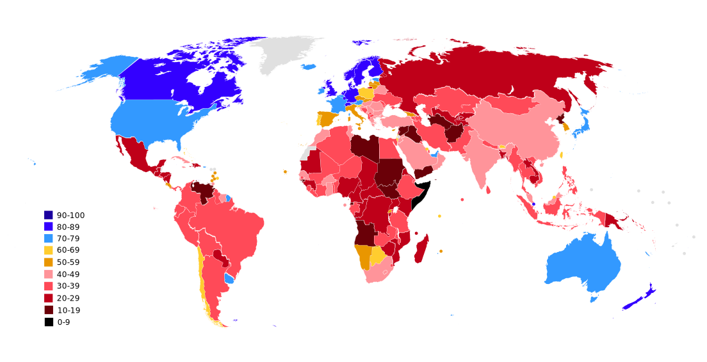

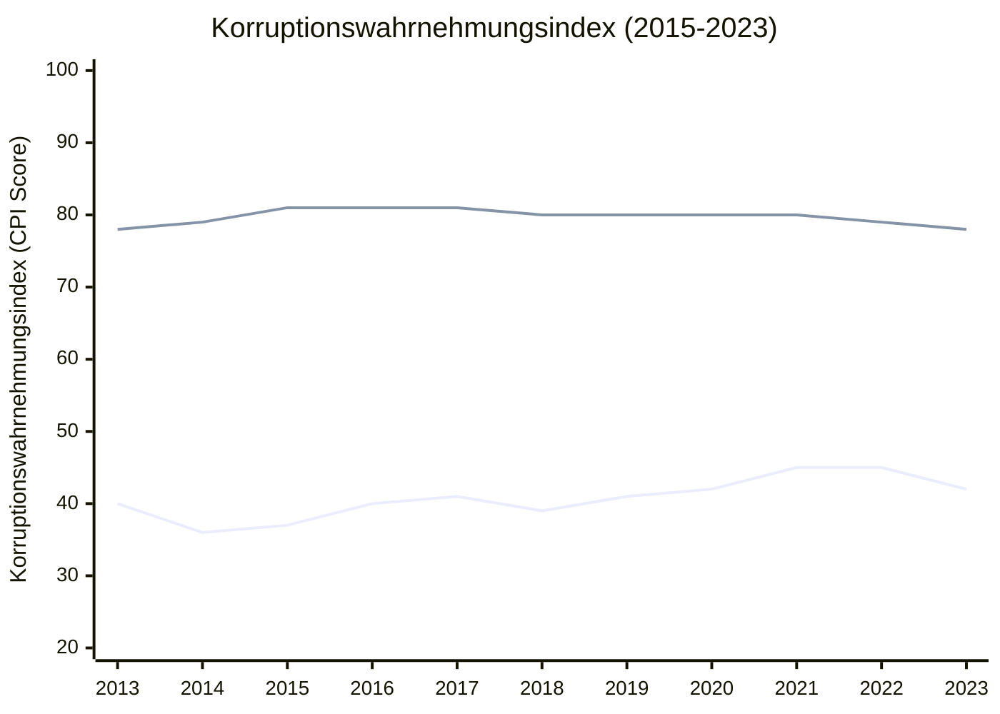

(Die Linie ganz oben steht für Deutschland und unten für China)

Oberflächlich betrachtet behauptet Xi., dass seine intensive Korruptionsbekämpfung Erfolge zeigt. Kürzlich veröffentlichten jedoch die Tsinghua-Universität und zwei Universitäten aus USA einen Forschungsbericht über den aktuellen Stand der Korruption in China. Die Wissenschaftler verglichen die offiziell angegebenen Gehälter von Beamten einer großen chinesischen Stadt mit den bei Hauskäufen registrierten Einkommensdetails. Sie stellten fest, dass je höher der Rang des Beamten, desto höher der Anteil des "informellen Einkommens" - also Einkommen unklarer Herkunft - am Gesamtgehalt. Die Untersuchung ergab, dass bei einem Beamten auf Abteilungsleiterebene das "informelle Einkommen" mehr als das Vierfache des "formellen Einkommens" betrug.

Was mich interessiert, ist dass [ein Text](http://fanfu.people.com.cn/n/2013/0205/c64371-20437546.html) behaupte, dass der Korruptionswahrnehmungsindex China ziemlich unfair bewertet.

So geht es um im Text:
> Nehmen wir als Beispiel die Punktzahl des Korruptionswahrnehmungsindex von 2012, bei dem China 39 Punkte erhielt. Diese Punktzahl wurde als Durchschnitt aus neun Datenquellen berechnet, darunter der Bertelsmann Transformationsindex, das IMD World Competitiveness Center und der Bribe Payers Index von Transparency International. Allerdings waren in diesen neun Berichten die Befragten selten Chinesen. Verstehen die Befragten aus anderen Ländern China wirklich? Haben sie China fair bewertet? Wie groß ist die Kluft zwischen ihrer subjektiven Wahrnehmung und den objektiven Fakten über China? All diese Fragen beeinflussen Chinas Punktzahl im Korruptionswahrnehmungsindex, was offensichtlich unfair ist.
> Daher sollten wir die Bewertung Chinas durch den Korruptionswahrnehmungsindex richtig einordnen. Einerseits bietet der Index eine internationale Perspektive zur Bewertung der Korruptionssituation in unserem Land, insbesondere die Einstellung von Geschäftsleuten, was direkte Auswirkungen auf praktische Fragen wie ausländische Investitionen hat. Andererseits sollten wir den Korruptionswahrnehmungsindex nicht blind als vollständig wissenschaftliche Grundlage für Antikorruptionsforschung und -praxis betrachten.
